```{r xaringanExtra, echo=FALSE}
xaringanExtra::use_xaringan_extra(c("tile_view", "animate_css", "tachyons"))
```

```{r xaringan-panelset, echo=FALSE}
xaringanExtra::use_panelset()
```

```{r xaringan-scribble, echo=FALSE}
xaringanExtra::use_scribble()
```

```{r progress, echo = FALSE}
xaringanExtra::use_progress_bar(color = "#0051BA", location = "bottom", height = "5px")
```

## [Panorama en México](https://jalilrt.github.io/Candidatura_presentacion/presentacion13_anexos.pdf)
----

- El alcoholismo es el padecimiento adictivo de mayor prevalencia.

```{r echo=FALSE, fig.align='center', out.width='100%',dpi=300}
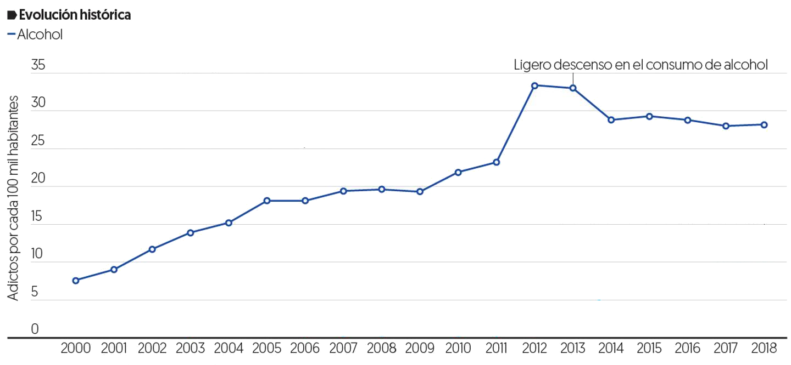
```
<p style="font-size:12pt" align="left"> Figura 1. Prevalencia en México de población adicta al consumo de alcohol </span> </p>

.footnote[----
Fuente: CIJ, INEGI y GLAC consulting]

---

## Trastorno por uso de alcohol
----

.pull-left[

Patrón desadaptativo de consumo que conlleva un deterioro o malestar clínicamente significativo expresado por tres o más de los siguientes síntomas (DSM-V).

- Diferentes maneras para su estudio

]

.pull-right[
```{r echo=FALSE, fig.align='center', out.width='100%',dpi=200}
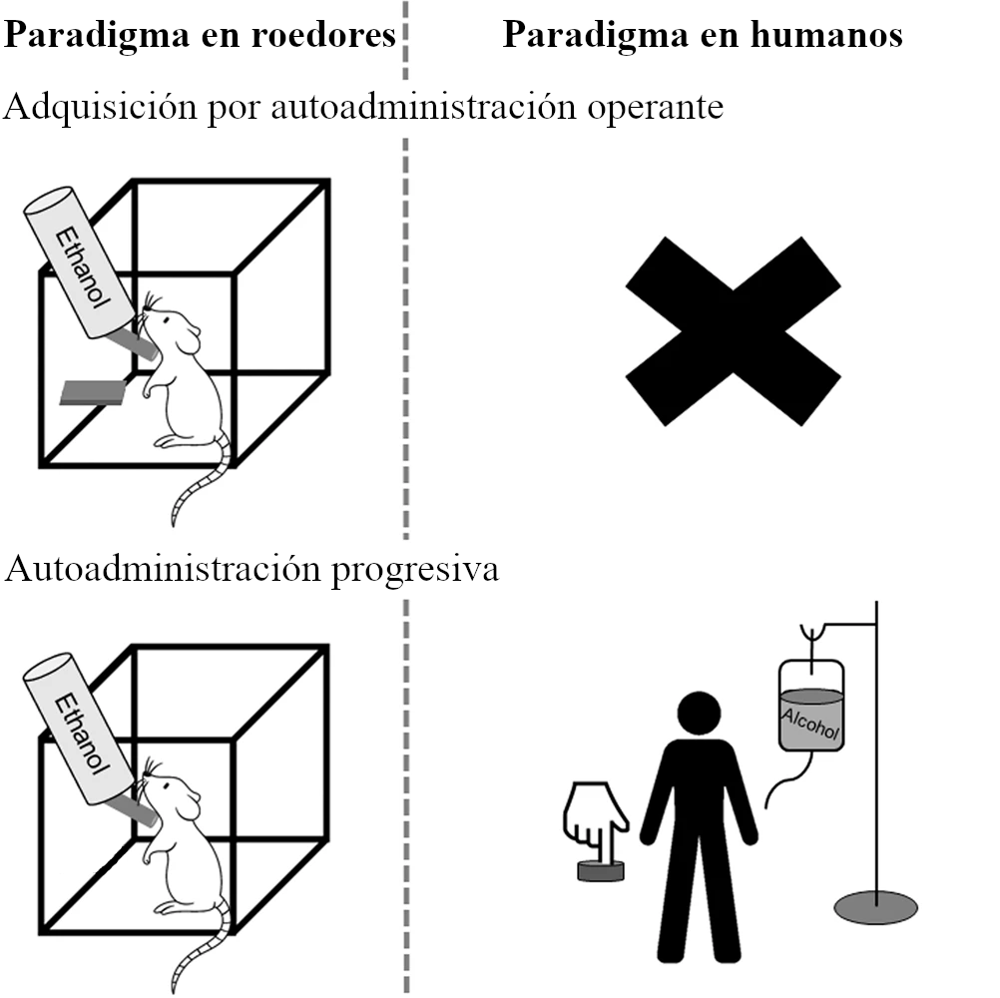
```
<p style="font-size:12pt" align="left"> Figura 2. Paradigmas de roedores y humanos para el estudio del trastorno por uso de alcohol a nivel translacional (Modificado de <span style="color:Blue">Nieto et al., 2021</span>) </p>

]

.footnote[----
American Psychiatric Association. (2013). Diagnostic and statistical manual of mental disorders (5th ed.)   

Nieto, S.J., Grodin, E.N., Aguirre, C.G. et al. (2021). Translational opportunities in animal and human models to study alcohol use disorder. Transl Psychiatry.]

---

## Elección de alcohol por 2 botellas
----
- Consumo voluntario por el alcohol.  
- Los animales tienen acceso a 2 botellas: una con agua y una de solución de etanol al 20% <span style="color:Blue">(Tabakoff $\&$ Hoffman, 2000)</span>.   

.pull-left[
```{r echo=FALSE, fig.align='center', out.width='70%',dpi=200}
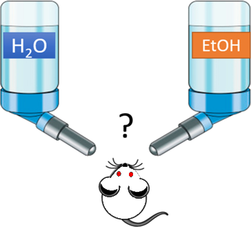
```
]

.pull-right[
```{r echo=FALSE, fig.align='center', out.width='80%',dpi=200}
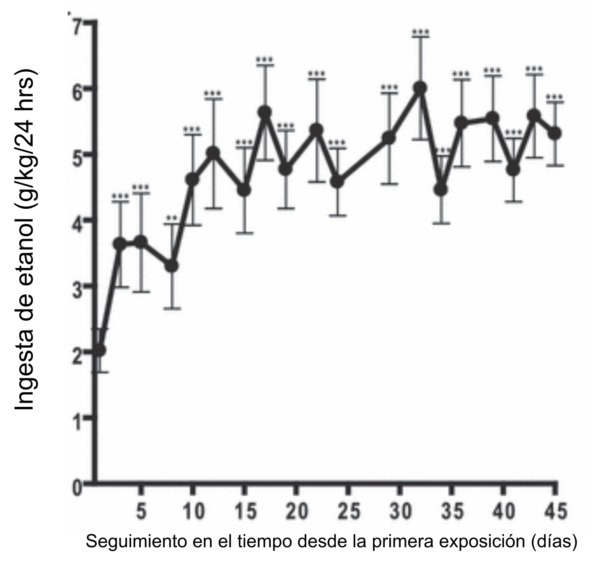
```
<p style="font-size:12pt" align="left"> Figura 3. Consumo alto de alcohol usando el modelo de acceso intermitente por 2 botellas (Modificado de <span style="color:Blue">Simms et al., 2008</span>) </p>
]

.footnote[----
Tabakoff $\&$ Hoffman. (2000). Animal Models in Alcohol Research   
Simms, J. A., Steensland, P., Medina, B., Abernathy, K. E., Judson Chandler, L., Wise, R., & Bartlett, S. E. (2008). Intermittent Access to 20% Ethanol Induces High Ethanol Consumption in Long-Evans and Wistar Rats. In Alcoholism: Clinical and Experimental Research ]

---

## Vías implicadas en el consumo
----

</br>
</br>

```{r echo=FALSE, fig.align='center', out.width='80%',dpi=200}
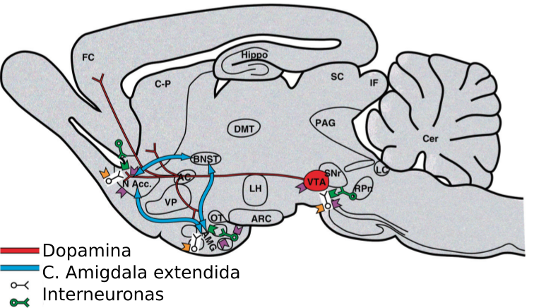
```
<p style="font-size:12pt" align="left"> Figura 4. Esquema de las vías implicadas en el consumo de alcohol (Modificado de <span style="color:Blue">Koob & Volkow, 2010</span>) </p>

.footnote[----
Koob, G. F., & Volkow, N. D. (2010). Neurocircuitry of addiction. Neuropsychopharmacology.]

---

## Estrés
----
- Percepción de la demanda excesiva del ambiente sobre la capacidad de un organismo <span style="color:Blue"> (Ruisoto $\&$ Contador, 2019) </span>
- Implica varios cambios fisiológicos que incluyen la activación del eje HPA.

```{r echo=FALSE, fig.align='center', out.width='40%',dpi=200}
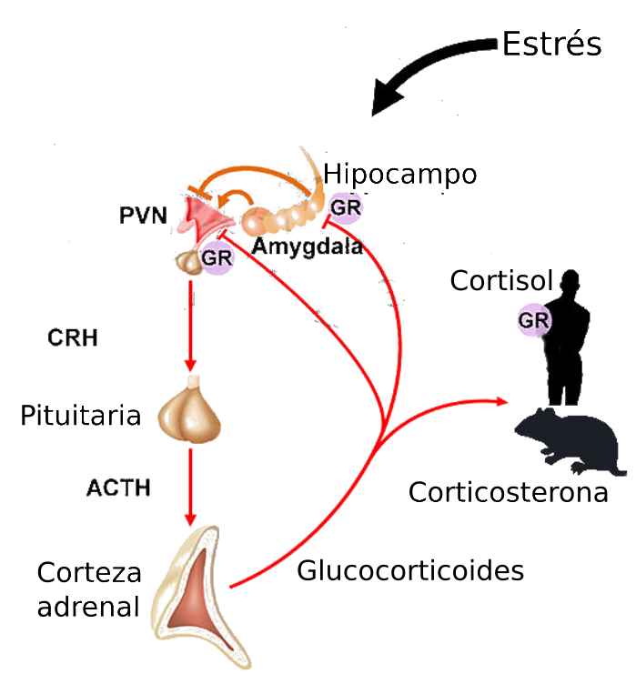
```
<p style="font-size:12pt" align="left"> Figura 5. Eje hipotálamo-pituitaria-adrenal (HPA) (Modificado de <span style="color:Blue">Joachim & Spangler, 2013</span>) </p>

.footnote[----
Ruisoto $\&$ Contador. (2019). The role of stress in drug addiction. An integrative review   
Joachim & Spengler. (2013). Epigenetic risk factors in PTSD and depression. Molecular Neuroendocrinology]

---

## Estrés crónico por restricción
----

- Estresor físico: restricción de movimiento.

```{r echo=FALSE, fig.align='center', out.width='20%',dpi=200}
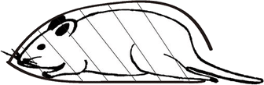
```

```{r echo=FALSE, fig.align='center', out.width='90%',dpi=200}

```
<p style="font-size:12pt" align="left"> Figura 6. Peso corporal diario (±SE) de grupos de 6 ratas macho Sprague-Dawley restringidas durante 3 h/día (Modificado de <span style="color:Blue">Harris et al., 1998</span>) </p>

.footnote[----
Harris et al. (1998). Effect of repeated stress on body weight and body composition of rats fed low- and high-fat diets]

---

## Interacción AUD-Estrés
----

- Incremento en el consumo de alcohol debido a intervenciones de estrés.

```{r echo=FALSE, fig.align='center', out.width='70%',dpi=200}
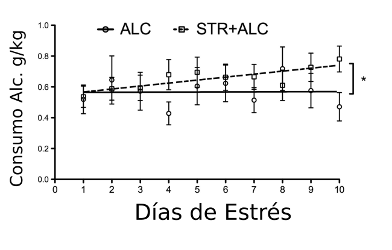
```
<p style="font-size:12pt"> 
Figura 7. Promedio de consumo durante la intervención a estrés (restricción) en ratas Wistar (Modificado de <span style="color:Blue">Gomez et al., 2012</span>)
</p>

.footnote[----
Gomez, et al. (2012). The interaction of chronic restraint stress and voluntary alcohol intake: effects on spatial memory in male rats]

---

## <span style="color:#0591d2"> Objetivo </span>
----

.blockquote[
<span style="color:#000000">Determinar la influencia longitudinal del estrés sobre el comportamiento de ingesta de alcohol y los cambios cerebrales derivados </span>
]

</br>

```{r echo=FALSE, fig.align='center', out.width='100%',dpi=200}
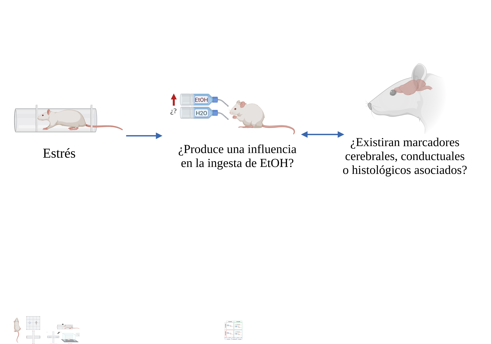
```

---

## <span style="color:#0591d2">Objetivos particulares </span>
----
.blockquote[

- <span style="color:#000000"> Analizar la conducta de ingesta y preferencia por la sustancia en un modelo de trastorno por uso de alcohol (AUD) en ratas. </span>
- <span style="color:#000000"> Establecer un modelo de estrés crónico mediante la restricción de movimiento a diferentes tiempos. </span>
- <span style="color:#000000"> Estudiar si el estrés crónico modifica la conducta de ingesta de alcohol y preferencia por la sustancia.  </span>
- <span style="color:#000000"> Determinar si el estrés crónico modifica las alteraciones conductuales o cognitivas producidas por la ingesta de alcohol. </span>
- <span style="color:#000000"> Caracterizar los cambios cerebrales estructurales y funcionales macroscópicos producidos por el consumo crónico de alcohol en presencia o ausencia de estrés crónico. </span>
- <span style="color:#000000"> Caracterizar los cambios cerebrales a nivel celular producidos por el consumo crónico de alcohol en presencia o ausencia de estrés crónico. </span>
]

---

### <span style="color:#0591d2">Hipótesis</span>
----
.blockquote[

- <span style="color:#000000"> El estrés crónico incrementará el nivel de consumo de alcohol en un modelo de AUD en ratas. </span>
- <span style="color:#000000"> Las ratas con fenotipo alcohólico tendrán alteraciones en volumen cerebral. En específico, se espera un aumento de volumen en corteza cingulada posterior y corteza medial prefrontal, así como disminución en tálamo, caudado, putamen y giro dentado </span>
- <span style="color:#000000"> El consumo crónico de alcohol más estrés crónico producirá un incremento en conectividad funcional entre la amígdala y la ínsula y/o estriado. </span>
- <span style="color:#000000"> El consumo crónico de alcohol más estrés crónico producirá incrementos en las alteraciones conductuales y en el déficit cognitivo en comparación con ratas con AUD sin estrés. </span>
]

---

## <span style="color:#0591d2">Objetivos particulares </span>
----
.blockquote[

- <span style="color:#CD5C5C"> Analizar la conducta de ingesta y preferencia por la sustancia en un modelo de trastorno por uso de alcohol (AUD) en ratas. </span>
- <span style="color:#000000"> Establecer un modelo de estrés crónico mediante la restricción de movimiento a diferentes tiempos. </span>
- <span style="color:#000000"> Estudiar si el estrés crónico modifica la conducta de ingesta de alcohol y preferencia por la sustancia.  </span>
- <span style="color:#000000"> Determinar si el estrés crónico modifica las alteraciones conductuales o cognitivas producidas por la ingesta de alcohol. </span>
- <span style="color:#000000"> Caracterizar los cambios cerebrales estructurales y funcionales macroscópicos producidos por el consumo crónico de alcohol en presencia o ausencia de estrés crónico. </span>
- <span style="color:#000000"> Caracterizar los cambios cerebrales a nivel celular producidos por el consumo crónico de alcohol en presencia o ausencia de estrés crónico. </span>
]

---
class: inverse, middle, center
background-image: images/restraint.png
background-size: contain

# Modelo de acceso intermitente a etanol por dos botellas (IA2BC)  

---

## Método

----

#### Animales

- Se incluyó 65 ratas Wistar (h = 33, m = 32)

#### Modelo de acceso intermitente a etanol por dos botellas

- El etanol (96%, v/v) se diluyó con agua purificada osmóticamente hasta una concentración final del 20% (v/v).
- Exposición a etanol únicamente los días: lunes, miércoles y viernes.
- Se aleatorizó el lugar de la botella.
- Duración total de 20 sesiones (sesión: día de alcohol y día de agua)

```{r echo=FALSE, fig.align='center', out.width='60%',dpi=200}
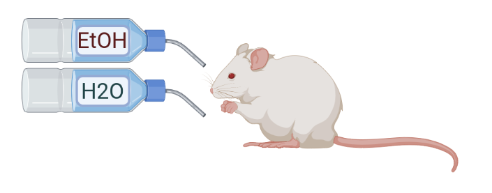
```

---

## Diseño
----

- Estudio experimental dividido en 4 fases: 1) pre-exposición, 2) exposición al modelo de acceso intermitente a etanol por dos botellas, 3) abstinencia, 4) recaída

</br>

```{r echo=FALSE, fig.align='center', out.width='80%',dpi=200}
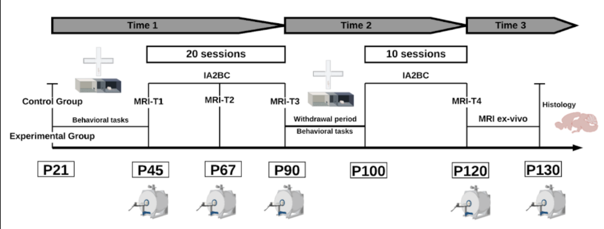
```

<p style="font-size:12pt" align="left"> Figura 1. Protocolo experimental representativo (modificado de<span style="color:Blue"> Ángeles, et al., en preparación</span>) </p>

.footnote[----
Angeles-Valdez, D., Lopez-Castro, A., Rasgado-Toledo, J., Maya-Arteaga J., Ortuzar, Alcauter S., Garza-Villarreal E.A. (En preparación). Brain structural and functional connectivity changes related to the development of alcohol use disorder in the adolescent rat]

---

## Resultados

.panelset[
.panel[.panel-name[Consumo EtOH]

```{r echo=FALSE, fig.align='center', out.width='65%',dpi=200}
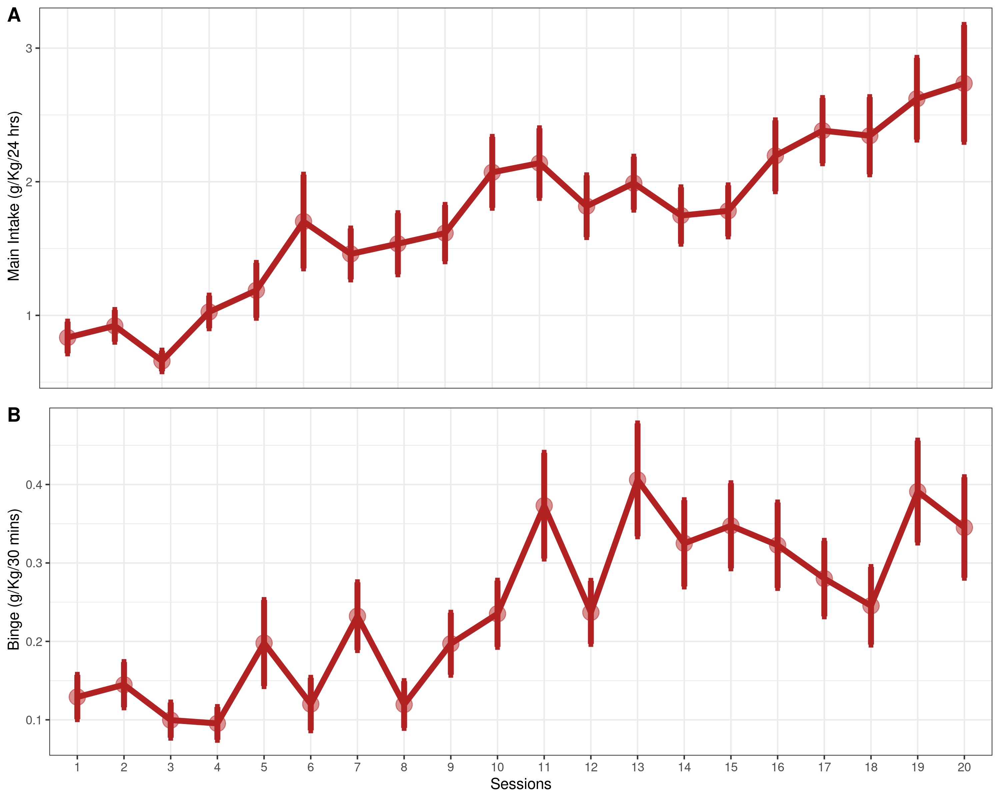
```
<p style="font-size:12pt" align="left"> Figura 2. Ingesta de etanol en ratas Wistar inducida por el modelo IA2BC durante la exposición al etanol </span> </p>

]
.panel[.panel-name[Clasificación]

```{r echo=FALSE, fig.align='center', out.width='80%',dpi=200}
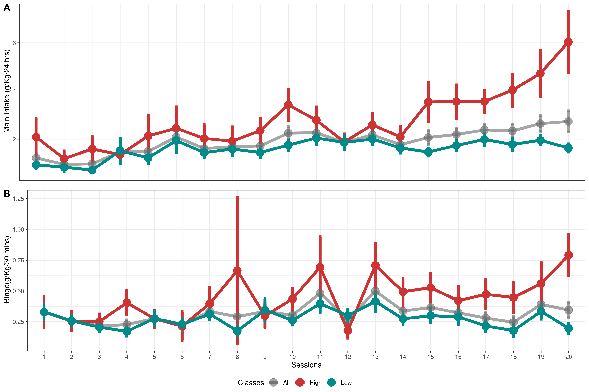
```
<p style="font-size:12pt" align="left"> Figura 3. Ingesta de etanol de las ratas clasificadas entre alta y baja ingesta utilizando un modelo de clases latentes </span> </p>

]
.panel[.panel-name[Cambios en volumen]

```{r echo=FALSE, fig.align='center', out.width='80%',dpi=200}
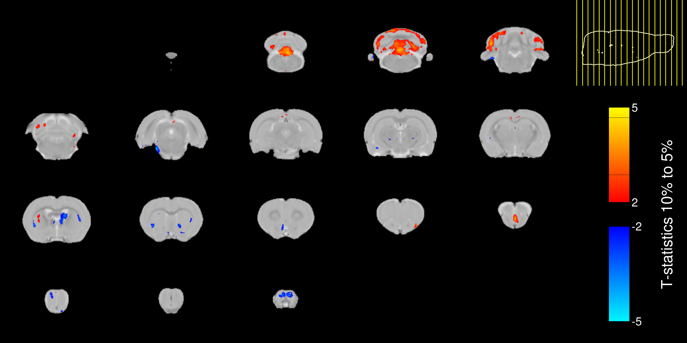
```
<p style="font-size:12pt" align="left"> Figura 4. Deformación volumétrica local en contraste de Alc > Ctrl. Mapas de valores-t. El aumento de los volúmenes locales se representa con colores cálidos, mientras que la disminución de los volúmenes locales se representa con colores fríos. </span> </p>

]
]

---

## <span style="color:#0591d2">Objetivos particulares </span>
----
.blockquote[

- <span style="color:#000000"> Analizar la conducta de ingesta y preferencia por la sustancia en un modelo de trastorno por uso de alcohol (AUD) en ratas. </span>
- <span style="color:#CD5C5C"> Establecer un modelo de estrés crónico mediante la restricción de movimiento a diferentes tiempos. </span>
- <span style="color:#000000"> Estudiar si el estrés crónico modifica la conducta de ingesta de alcohol y preferencia por la sustancia.  </span>
- <span style="color:#000000"> Determinar si el estrés crónico modifica las alteraciones conductuales o cognitivas producidas por la ingesta de alcohol. </span>
- <span style="color:#000000"> Caracterizar los cambios cerebrales estructurales y funcionales macroscópicos producidos por el consumo crónico de alcohol en presencia o ausencia de estrés crónico. </span>
- <span style="color:#000000"> Caracterizar los cambios cerebrales a nivel celular producidos por el consumo crónico de alcohol en presencia o ausencia de estrés crónico. </span>
]

---
class: inverse, middle, center
background-image: images/restraint.png
background-size: contain

# Modelo de estrés crónico por restricción (CRS): Piloto

---

## Método
----

#### Animales

- Se incluyó 12 ratas Wistar (h = 6, m = 6)

#### Modelo crónico de restricción de movimiento

<p style="font-size:14pt">
- Ambiente controlado con acceso libre al agua y comida </br>
- Ciclo invertido 12h (oscuridad/luz) </br>
- Restricción: lapso 11:00-14:00 (20/31 días) </br>
- El peso corporal, el alimento y el consumo de agua fueron medidos diariamente como medidores de respuesta a estrés <span style="color:Blue">(Martí et al., 1994)</span>.
</p>

```{r echo=FALSE, fig.align='center', out.width='60%',dpi=200}
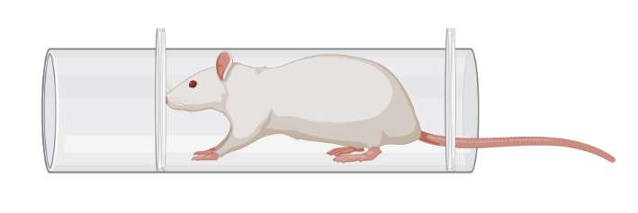
```

.footnote[----
Martí, O., Martí, J., & Armario, A. (1994). Effects of chronic stress on food intake in rats: influence of stressor intensity and duration of daily exposure]

---

## Diseño
----
</br>
```{r echo=FALSE, fig.align='center', out.width='90%',dpi=200}
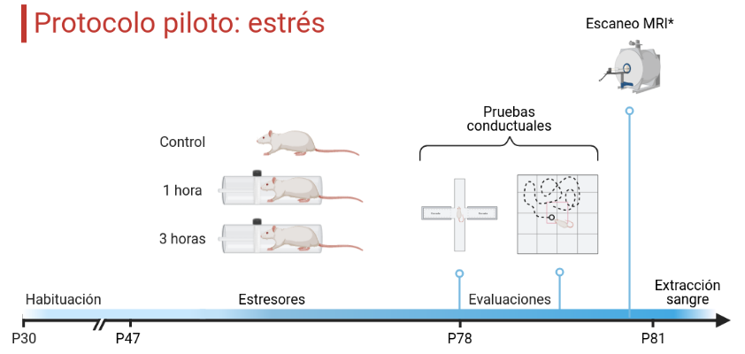
```
<p style="font-size:12pt" align="left"> Figura 2. Protocolo de inducción de estrés. Inicio del protocolo al P47, y finalización en el P78 (duración: 30 días). Utilización de 3 grupos (control, 1 hora y 3 horas de estresor). * El escaneo cerebral por resonancia magnética fue realizado únicamente para el lote 2 con el objetivo de comprobar que se pudieran obtener imágenes usando isofluorano en el grupo de estrés. </span> </p>

---

## Resultados

.panelset[
.panel[.panel-name[Crecimiento]

```{r echo=FALSE, fig.height=6, fig.width=11.8, message=FALSE, warning=FALSE, cache=FALSE, paged.print=FALSE, results='asis',dpi=200}

setwd("/home/jalil/Documents/Psilantro/meh2/Semestre_4/data/pilot/")
pacman::p_load(tidyverse,ggthemes,cowplot,ggstatsplot,ggpubr, plotly)
stress_batch1<-read_csv("Stress_pilot.csv")
std <- function(x) sd(x)/sqrt(length(x))
stress_batch1 <- stress_batch1 %>% group_by(Group,Age) %>% 
  summarise(Weigthstd=std(Weight),Weight=mean(Weight))

stress_batch1_Weight<-stress_batch1 %>% 
  ggplot(aes(x=Age,y=Weight,color=as.factor(Group))) + geom_point() + geom_line() +
  geom_rangeframe() + theme_tufte() + ylab("Peso") + xlab("Edad") +
  theme(legend.position = "bottom", legend.title = element_text(face="bold", size=20), 
  legend.text = element_text(size=18),
  axis.text = element_text(size=16), axis.title = element_text(size=18)) +
  scale_color_excel_new(name = "Grupo", labels = c("1 Hr", "3 Hrs", "Ctrl")) +
  scale_x_discrete(breaks = c("P47", "P52", "P57", "P62", "P67", "P72", "P77")) +
  geom_pointrange(aes(ymin=Weight - Weigthstd, ymax=Weight + Weigthstd))

stress_batch1_Weight

```
<p style="font-size:12pt" align="left"> Figura 1. Crecimiento longitudinal en peso de cada grupo. Se muestra el cambio de peso desde el inicio del protocolo de estrés crónico. </span> </p>

]
.panel[.panel-name[Estadística]

```{r echo=FALSE, fig.height=6, fig.width=11.8, message=FALSE, warning=FALSE, cache=FALSE, paged.print=FALSE, results='asis',dpi=200}
stress_batch1_Weight_comparison<-stress_batch1 %>% group_by(Group,Age) %>% 
  summarise(Weight=mean(Weight)) %>%
  ggbetweenstats(x=Group,y=Weight, type = "np", p.adjust.method = "fdr") +
  scale_x_discrete(labels = c("1 Hr", "3 Hrs", "Ctrl")) + xlab(element_blank()) + ylab("Peso") +
  theme(axis.text = element_text(size = 16), axis.title = element_text(size=18), 
  plot.caption=element_blank()) + 
  scale_color_excel_new()

stress_batch1_Weight_comparison

```
<p style="font-size:12pt" align="left"> Figura 2. Media del peso de cada grupo durante el protocolo de estrés. </span> </p>

]
]

---

## <span style="color:#0591d2">Objetivos particulares </span>
----
.blockquote[

- <span style="color:#000000"> Analizar la conducta de ingesta y preferencia por la sustancia en un modelo de trastorno por uso de alcohol (AUD) en ratas. </span>
- <span style="color:#000000"> Establecer un modelo de estrés crónico mediante la restricción de movimiento a diferentes tiempos. </span>
- <span style="color:#CD5C5C"> Estudiar si el estrés crónico modifica la conducta de ingesta de alcohol y preferencia por la sustancia.  </span>
- <span style="color:#000000"> Determinar si el estrés crónico modifica las alteraciones conductuales o cognitivas producidas por la ingesta de alcohol. </span>
- <span style="color:#000000"> Caracterizar los cambios cerebrales estructurales y funcionales macroscópicos producidos por el consumo crónico de alcohol en presencia o ausencia de estrés crónico. </span>
- <span style="color:#000000"> Caracterizar los cambios cerebrales a nivel celular producidos por el consumo crónico de alcohol en presencia o ausencia de estrés crónico. </span>
]

---
class: inverse, middle, center
background-image: images/restraint.png
background-size: contain

# Modelo IA2BC - CRS

---

## Método
----

#### Materiales

- A | Restrictor de movimiento construido en acrílico con ajuste para el tamaño de la rata
- B | Dos botellas, una con agua y otra con Etanol al 20%

```{r echo=FALSE, fig.align='center', out.width='90%',dpi=200}
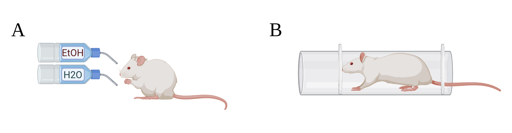
```
#### Animales: 
<p style="font-size:12pt">
- 30 ratas Wistar (16 hembras)
- Ciclo invertido 12h (oscuridad/luz): encendido 7 am </br>
- Restricción: lapso 11:00-14:00 </br>
- El peso corporal y el alimento fueron medidos diariamente como medidores de respuesta a estrés </br>
- Extracción de sangre para prueba de corticosterona (~12:00 pm), posterior a 1 hr de restricción.
</p>

---

## Diseño
----

```{r echo=FALSE, fig.align='center', out.width='50%',dpi=200}
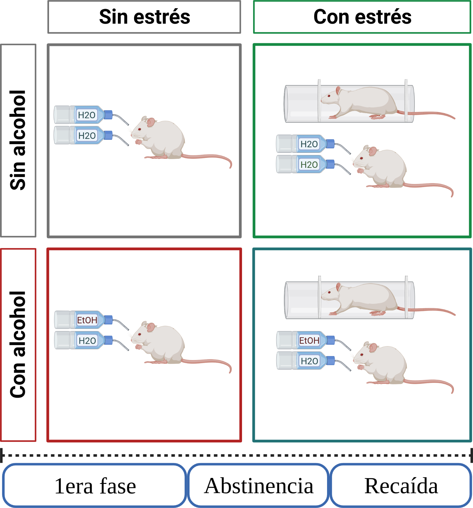
```
<p style="font-size:12pt" align="center"> Figura 1. Diseño experimental </span> </p>

---

## 

</br>
</br>
</br>

```{r echo=FALSE, fig.align='center', out.width='90%',dpi=200}
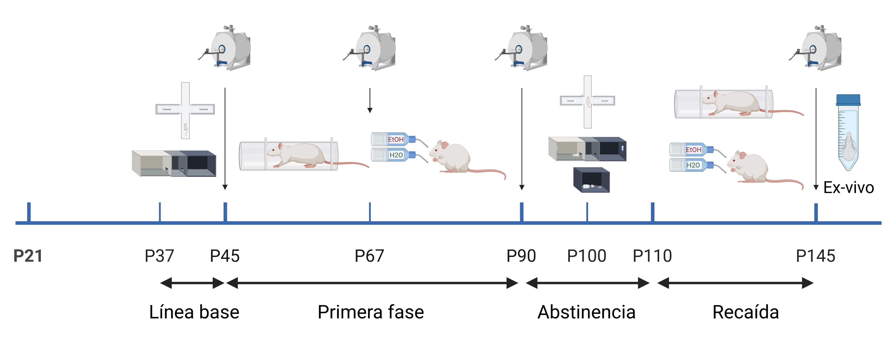
```
<p style="font-size:12pt" align="left"> Figura 2. Protocolo de modelo de acceso intermitente por 2 botellas (IA2BC) y de estrés crónico (restricción de movimiento). </span> </p>


---

## Efectos por estrés

.panelset[
.panel[.panel-name[Crecimiento]

```{r echo=FALSE, fig.height=6, fig.width=11.8, message=FALSE, warning=FALSE, cache=FALSE, paged.print=FALSE, results='asis',dpi=200}
setwd("/home/jalil/Documents/Psilantro/meh2/")

pacman::p_load(tidyverse,data.table,ggpubr,plyr,hablar,ggstatsplot,
               ggthemes,rstatix,lme4,ggdist,distributional,
               emmeans,sjstats,easystats)

setwd("~/Documents/Psilantro/meh2/Semestre_3/Tutoral3/Datasets/")
files <- list.files(pattern = "*.csv")
data <- rbind.fill(lapply(files, fread, header=TRUE))
data_j <- data %>%  convert(chr(Sex,RID,Session,Phase),
                            num(Age,Weight_kg,EtOH,H2O,Weight_kg_base)) 

data3_all <- data_j %>%
  filter(Condition_day == "EtOH") %>% 
  select(RID,Sex,Session,Weight_kg,Weight_kg_base,Group,Condition, EtOH,H2O, Phase) %>%
  gather(EtOH, H2O, value = "value", key = "Bottle") %>%
  spread(Condition,value) %>% 
  group_by(Bottle) 

data3_all <- data3_all %>% mutate(`24_hrs` = case_when(`24_hrs` >=40 ~ `24_hrs`))

Data <- data3_all %>% 
  mutate(start_30mins = start - `30_mins`, 
         start_24_hrs = start - `24_hrs`,
         main_intake = (start_24_hrs * Weight_kg),
         basal_start = start - 27, 
         basal_30min = `30_mins` - 27,
         Basal_24hrs = `24_hrs` - 27,
         T_30min = basal_start - basal_30min,
         T_24hrs = basal_start - Basal_24hrs,
         Total_fluid_intake_24_ml = (T_24hrs * 100)/98.0608,
         Total_fluid_intake_30_ml = (T_30min * 100)/98.0608,
         Binge = (start_30mins* Weight_kg)) 

Data <-  Data %>% 
  filter(Bottle == "EtOH") 
Data$Session <- as.numeric(Data$Session)

Data <- Data %>% rename(replace = c("Group"="Grupo"))
Data <- Data %>% mutate(Phase = case_when(Phase == "Model" ~ "Autoadministración crónica",
                                  Phase == "Relapse" ~ "Recaída"))

Crecimiento.plt <- ggline(Data %>% filter(Phase=="Autoadministración crónica"), 
                          x = "Session", xlab = "Sesión",
                          y =  "Weight_kg_base", group = "Grupo",
                          add = c("mean_se"), size=2,color = "Grupo", 
                          facet.by = "Phase",ylab = "Peso (kg)",
                          palette = c("#B22222","#217175","#737373", "#168a44")) +
  annotate("rect", xmin = 1, xmax = 6, ymin = 0, ymax = 0.25,alpha = .2) +
  annotate(geom="text", x=11, y=0.24, label="*",
           color="black") +
  annotate(geom="text", x=12, y=0.24, label="*",
           color="black") +
  annotate(geom="text", x=13, y=0.24, label="*",
           color="black") +
  annotate(geom="text", x=15, y=0.24, label="*",
           color="black") +
  annotate(geom="text", x=16, y=0.24, label="*",
           color="black") +
  annotate(geom="text", x=17, y=0.24, label="*",
           color="black") +
  annotate(geom="text", x=18, y=0.24, label="*",
           color="black") +
  annotate(geom="text", x=19, y=0.24, label="*",
           color="black")

Crecimiento.plt_abs <- ggline(Data %>% filter(Phase=="Recaída"), 
                          x = "Session", xlab = "Sesión",
                          y =  "Weight_kg_base", group = "Grupo",
                          add = c("mean_se"), size=2,color = "Grupo", 
                          facet.by = "Phase",ylab = "Peso (kg)",
                          palette = c("#B22222","#217175","#737373", "#168a44")) +
  annotate("rect", xmin = 1, xmax = 6, ymin = 0, ymax = 0.25,alpha = .2) +
  annotate(geom="text", x=1, y=0.26, label="*",
           color="black") +
  annotate(geom="text", x=4, y=0.26, label="*",
           color="black") +
  annotate(geom="text", x=5, y=0.26, label="*",
           color="black") +
  annotate(geom="text", x=6, y=0.26, label="*",
           color="black") +
  annotate(geom="text", x=7, y=0.26, label="*",
           color="black") +
  annotate(geom="text", x=11, y=0.26, label="*",
           color="black") +
  annotate(geom="text", x=13, y=0.26, label="*",
           color="black") +
  annotate(geom="text", x=14, y=0.26, label="*",
           color="black")

Crecimiento_both <- ggarrange(Crecimiento.plt,Crecimiento.plt_abs +
            theme(axis.title.y = element_blank(),
                  axis.text.y = element_blank()),
          common.legend = T)

Crecimiento_both

```
<p style="font-size:12pt" align="left"> Figura 3. Crecimiento longitudinal en peso de cada grupo. Se muestra el cambio de peso desde el inicio del protocolo de estrés y IA2BC. Área sombreada indica la fase aguda de la intervención. </span> </p>

]
.panel[.panel-name[Abstinencia]
```{r echo=FALSE, fig.height=6.3, fig.width=11.8, message=FALSE, warning=FALSE, cache=FALSE, paged.print=FALSE, results='asis',dpi=200}
setwd("/home/jalil/Documents/Psilantro/meh2/Semestre_3/")
stressAbst_batch1<-read_csv("Abst_Bitacora.csv")
stressAbst_batch1 <- stressAbst_batch1 %>% rename(replace = c("Group"="Grupo"))

Abstinencia_plot <- ggline(stressAbst_batch1, x = "Age", y =  "Weight_kg_base", 
                           group = "Grupo",add = c("mean_se"), size=2,color = "Grupo", 
                           ylab = "Peso (kg)",xlab = "Edad",
                           palette = c("#B22222","#217175","#737373", "#168a44")) +
  annotate(geom="text", x=17, y=0.082, label="*",
           color="black") +
  annotate(geom="text", x=18, y=0.082, label="*",
           color="black")
Abstinencia_plot
```
<p style="font-size:12pt" align="left"> Figura 4. Crecimiento longitudinal. Se muestra el cambio de peso desde el inicio de la abstinencia. </span> </p>

]
.panel[.panel-name[Corticosterona]
```{r echo=FALSE, fig.height=6.3, fig.width=11.8, message=FALSE, warning=FALSE, cache=FALSE, paged.print=FALSE, results='asis',dpi=200}
setwd("~/Documents/Alc_model/")

Cort_lev <- readxl::read_excel("Cort_levels.xlsx")
Cort_lev_std <- Cort_lev %>% slice(1:6)
Strss <- Cort_lev %>% slice(7:42) %>% select(1:3)
cuca <- lm(formula = Y~log(Absorbance),data = Cort_lev_std)

Strss$Y <- predict(cuca,Strss)
both <- rbind(Cort_lev_std,Strss) %>% 
  mutate(Y = case_when(Y = Y >= 0 ~ Y,
                       Y = Y <= 0 ~ 0.01)) %>% 
  mutate(Y = Y*2.886)

cortico <- both %>% slice(7:42) %>% 
  ggbetweenstats(x=Group,y=Y, type = "np", p.adjust.method = "fdr",
                 plot.type = "violin",ylab = "Corticosterona (nmol/L)",
                 xlab = "Grupo",
                 centrality.point.args = list(size = 3, color = "darkred")) +
  theme(text = element_text(size = 14),
        axis.text = element_text(size = 16), 
        axis.title = element_text(size=18)) +
  scale_color_manual(values = c("#B22222","#217175","#737373", "#168a44"))
cortico

```
<p style="font-size:12pt" align="left"> Figura 5. Medición de corticosterona en el P142 en una submuestra. </span> </p>

]
]

---

## Ingesta de alcohol

.panelset[
.panel[.panel-name[Ingesta principal]

```{r echo=FALSE, fig.height=6, fig.width=11.8, message=FALSE, warning=FALSE, cache=FALSE, paged.print=FALSE, results='asis',dpi=200}
Data_al <-  Data %>% 
  filter(Bottle == "EtOH", Grupo == "Alc" | Grupo == "Alc+Str")
Data_al$Session <- as.numeric(Data_al$Session)

Intake_plot <- ggline(Data_al, x = "Session", y =  "main_intake", 
       group = "Grupo",add = c("mean_se"), size=1,color = "Grupo", 
       facet.by = "Phase",ylab = "Consumo EtOH (g/kg/24 hrs)",xlab = "Sesión",
       palette = c("#B22222","#217175","#737373", "#168a44")) +
  annotate("rect", xmin = 1, xmax = 6, ymin = 0, ymax = 7,alpha = .2)
Intake_plot

```
<p style="font-size:12pt" align="left"> Figura 1. Ingesta de etanol en ratas Wistar inducida por el modelo IA2BC durante la exposición al etanol y la recaída en cada grupo. Área sombreada indica la fase aguda de la intervención. </span> </p>

]
]

---

## <span style="color:#0591d2">Objetivos particulares </span>
----
.blockquote[

- <span style="color:#000000"> Analizar la conducta de ingesta y preferencia por la sustancia en un modelo de trastorno por uso de alcohol (AUD) en ratas. </span>
- <span style="color:#000000"> Establecer un modelo de estrés crónico mediante la restricción de movimiento a diferentes tiempos. </span>
- <span style="color:#000000"> Estudiar si el estrés crónico modifica la conducta de ingesta de alcohol y preferencia por la sustancia.  </span>
- <span style="color:#CD5C5C"> Determinar si el estrés crónico modifica las alteraciones conductuales o cognitivas producidas por la ingesta de alcohol. </span>
- <span style="color:#000000"> Caracterizar los cambios cerebrales estructurales y funcionales macroscópicos producidos por el consumo crónico de alcohol en presencia o ausencia de estrés crónico. </span>
- <span style="color:#000000"> Caracterizar los cambios cerebrales a nivel celular producidos por el consumo crónico de alcohol en presencia o ausencia de estrés crónico. </span>
]

---

## Pruebas conductuales
----

</br>
</br>

```{r echo=FALSE, fig.align='center', out.width='90%',dpi=200}
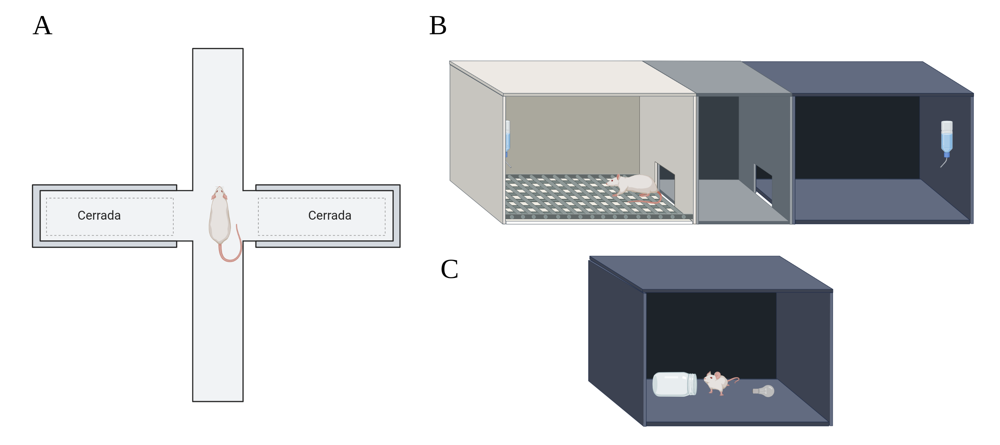
```

<p style="font-size:12pt">
- A | LEC: 5 minutos <span style="color:Blue">(Walf and Frye, 2007)</span> </br>
- B | CPL: 10 y 30 minutos <span style="color:Blue">(Lucke-Wold, 2011)</span> </br>
- C | NOR: 3 minutos
</p>

.footnote[----
Walf, A. A., & Frye, C. A. (2007). The use of the elevated plus maze as an assay of anxiety-related behavior in rodents. Nature protocols </br>
Lucke-Wold, Brandon. (2011). The Varied Uses of Conditioned Place Preference in Behavioral Neuroscience Research: An Investigation of Alcohol Administration in Model Organisms.]

---
background-image: url("assets/DLC.png")
background-size: 120px
background-position: 90% 2%

## Análisis conductual

.panelset[
.panel[.panel-name[EPM cerrado]

```{r echo=FALSE, fig.height=6.3, fig.width=11.8, message=FALSE, warning=FALSE, cache=FALSE, paged.print=FALSE, results='asis',dpi=200}
setwd("/home/jalil/Documents/Psilantro/meh2/Semestre_4/Analisis/Conducta/")
EPM <- read_csv("EPM_average.csv")

EPM <- EPM %>% rename(replace = c("Group"="Grupo"))
EPM <- EPM %>% mutate(Arm = case_when(Arm == "Closed" ~ "Cerrado",
                                      Arm == "Open" ~ "Abierto"),
                      Grupo=factor(Grupo),
                      RID=factor(RID),
                      Stage=factor(Stage),
                      Arm=factor(Arm),
                      Age=factor(Age),
                      Sex=factor(Sex)) 

EPM_closed <- EPM %>% filter(Arm=="Cerrado")

EPM_closed.aov <- anova_test(data = EPM_closed, dv = Time, wid = RID,
                             between = Grupo, within = Stage)

# Pairwise comparisons between time points at each group levels
# Paired t-test is used because we have repeated measures by time
EPM_closed.pwc2 <- EPM_closed %>%
  group_by(Grupo) %>%
  pairwise_t_test(
    Time ~ Stage, paired = TRUE, 
    p.adjust.method = "fdr")

## Visualization
EPM_closed.pwcC <- EPM_closed.pwc2 %>% 
  add_xy_position(x = "Stage",group = "Grupo",
                  step.increase = 1,fun = "mean_se")

my_pal <- c("#B22222","#217175","#737373", "#168a44")

plot_EPM.closed <- EPM_closed %>%
  ggplot(aes(x = Stage,y = Time, 
             fill = Grupo)) +
  stat_halfeye(position = "dodge",
               adjust = .9, width = .7) +
  gghalves::geom_half_point(aes(color = Grupo),
                            side = "l", 
                            range_scale = .3, 
                            alpha = .4, size = 2) + 
  stat_pvalue_manual(EPM_closed.pwcC,
                     tip.length = 0.03, hide.ns = TRUE) +
  labs(subtitle = get_test_label(EPM_closed.aov, 
                                 detailed = TRUE),
       caption = get_pwc_label(EPM_closed.pwcC)) +
  xlab("Punto de tiempo") + ylab("Tiempo (s)") +
  scale_color_manual(values = my_pal) +
  scale_fill_manual(values = my_pal) + 
  theme_ggdist() +
  theme(text = element_text(size = 18),
        plot.subtitle = element_text(hjust = 1)) 

plot_EPM.closed

```
<p style="font-size:12pt" align="left"> Figura 1. Tiempo de exploración en brazos cerrados por punto de tiempo. </span> </p>

]
.panel[.panel-name[EPM abierto]

```{r echo=FALSE, fig.height=6.3, fig.width=11.8, message=FALSE, warning=FALSE, cache=FALSE, paged.print=FALSE, results='asis',dpi=200}

EPM_open <- EPM %>% filter(Arm=="Abierto")

EPM_open.aov <- anova_test(data = EPM_open, dv = Time, wid = RID,
                             between = Grupo, within = Stage)

EPM_open.pwc2 <- EPM_open %>%
  group_by(Grupo) %>%
  pairwise_t_test(
    Time ~ Stage, paired = TRUE, 
    p.adjust.method = "fdr")

## Visualization
EPM_open.pwcC <- EPM_open.pwc2 %>% 
  add_xy_position(x = "Stage",group = "Grupo",
                  step.increase = 1,fun = "mean_se")

my_pal <- c("#B22222","#217175","#737373", "#168a44")

plot_EPM.open <- EPM_open %>%
  ggplot(aes(x = Stage,y = Time, 
             fill = Grupo)) +
  stat_halfeye(position = "dodge",
               adjust = .9, width = .7) +
  gghalves::geom_half_point(aes(color = Grupo),
                            side = "l", 
                            range_scale = .3, 
                            alpha = .4, size = 2) + 
  stat_pvalue_manual(EPM_open.pwcC,
                     tip.length = 0.03, hide.ns = TRUE) +
  labs(subtitle = get_test_label(EPM_open.aov, 
                                 detailed = TRUE),
       caption = get_pwc_label(EPM_open.pwcC)) +
  xlab("Punto de tiempo") + ylab("Tiempo (s)") +
  scale_color_manual(values = my_pal) +
  scale_fill_manual(values = my_pal) + 
  theme_ggdist() +
  theme(text = element_text(size = 18),
        plot.subtitle = element_text(hjust = 1))

plot_EPM.open
```
<p style="font-size:12pt" align="left"> Figura 2. Tiempo de exploración en brazos abiertos por punto de tiempo. </span> </p>

]
.panel[.panel-name[Preferencia (CPP)]

```{r echo=FALSE, fig.height=6.3, fig.width=11.8, message=FALSE, warning=FALSE, cache=FALSE, paged.print=FALSE, results='asis',dpi=200}
setwd("/home/jalil/Documents/Psilantro/meh2/Semestre_3/Tutoral3/Bev/")
CPP <- read_csv("CPP.csv") %>% 
  mutate(Place = case_when(Place == "Dark" ~ "Water",
                           Place == "White" ~ "EtOH"),
         Batch = case_when(Batch == "4" ~ "Batch 4",
                           Batch == "5" ~ "Batch 5"))

B4cpp <- CPP %>% filter(Batch=="Batch 4") %>% 
  pivot_wider(names_from = Place,values_from = Time_seg) %>% 
  mutate(#Water = (Water*100)/600,
         #EtOH = (EtOH*100/600),
         Preferencia = EtOH/(EtOH+Water))

B5cpp <- CPP %>% filter(Batch=="Batch 5") %>% 
  pivot_wider(names_from = Place,values_from = Time_seg) %>% 
  mutate(#Water = (Water*100)/1800,
         #EtOH = (EtOH*100/1800),
         Preferencia = EtOH/(EtOH+Water))

Bcpp <- rbind(B4cpp,B5cpp)

Bcpp.aov <- anova_test(data = Bcpp, dv = Preferencia, wid = RID,
                             between = Group, within = Stage)

Bcpp.pwc2 <- Bcpp %>%
  group_by(Group) %>%
  pairwise_t_test(
    Preferencia ~ Stage, paired = TRUE, 
    p.adjust.method = "fdr")

Bcpp.pwcC <- Bcpp.pwc2 %>% 
  add_xy_position(x = "Time",group = "Group",
                  step.increase = 1,fun = "mean_se")

my_pal <- c("#B22222","#217175","#737373", "#168a44")

plot_Bcpp <- Bcpp %>%
  ggplot(aes(x = Stage,y = Preferencia, 
             fill = Group)) +
  stat_halfeye(position = "dodge",
               adjust = .9, width = .7) +
  gghalves::geom_half_point(aes(color = Group),
                            side = "l", 
                            range_scale = .3, 
                            alpha = .4, size = 2) + 
  stat_pvalue_manual(Bcpp.pwcC,
                     tip.length = 0.03, hide.ns = FALSE) +
  labs(subtitle = get_test_label(Bcpp.aov, 
                                 detailed = TRUE),
       caption = get_pwc_label(Bcpp.pwcC)) +
  xlab("Punto de tiempo") + ylab("Preferencia caja EtOH") +
  scale_color_manual(values = my_pal) +
  scale_fill_manual(values = my_pal) + 
  geom_hline(yintercept=0.5, linetype="dashed", color = "red") +
  theme_ggdist() +
  theme(text = element_text(size = 18),
        plot.subtitle = element_text(hjust = 1)) 

plot_Bcpp

```
<p style="font-size:12pt" align="left"> Figura 3. Preferencia en tiempo pasado en la caja EtOH entre pretest vs test. </span> </p>

]
]

---

## <span style="color:#0591d2">Objetivos particulares </span>
----
.blockquote[

- <span style="color:#000000"> Analizar la conducta de ingesta y preferencia por la sustancia en un modelo de trastorno por uso de alcohol (AUD) en ratas. </span>
- <span style="color:#000000"> Establecer un modelo de estrés crónico mediante la restricción de movimiento a diferentes tiempos. </span>
- <span style="color:#000000"> Estudiar si el estrés crónico modifica la conducta de ingesta de alcohol y preferencia por la sustancia.  </span>
- <span style="color:#000000"> Determinar si el estrés crónico modifica las alteraciones conductuales o cognitivas producidas por la ingesta de alcohol. </span>
- <span style="color:#CD5C5C"> Caracterizar los cambios cerebrales estructurales y funcionales macroscópicos producidos por el consumo crónico de alcohol en presencia o ausencia de estrés crónico. </span>
- <span style="color:#000000"> Caracterizar los cambios cerebrales a nivel celular producidos por el consumo crónico de alcohol en presencia o ausencia de estrés crónico. </span>
]

---

## Análisis de neuroimagen

.panelset[
.panel[.panel-name[Cambios volumétricos]

```{r echo=FALSE, fig.align='center', out.width='90%',dpi=200}
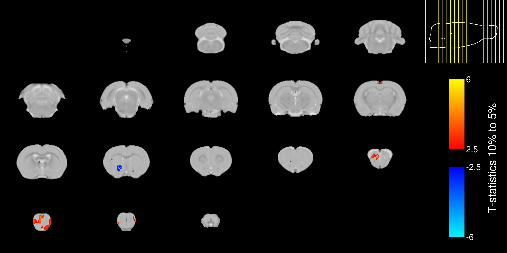
```
<p style="font-size:12pt" align="left"> Figura 1. Deformación volumétrica local en contraste de Alc+Str > Alc Mapas de valores-t. El aumento de los volúmenes locales se representa con colores cálidos, mientras que la disminución de los volúmenes locales se representa con colores fríos. </span> </p>

]
.panel[.panel-name[Cambios volumétricos]

```{r echo=FALSE, fig.align='center', out.width='90%',dpi=200}
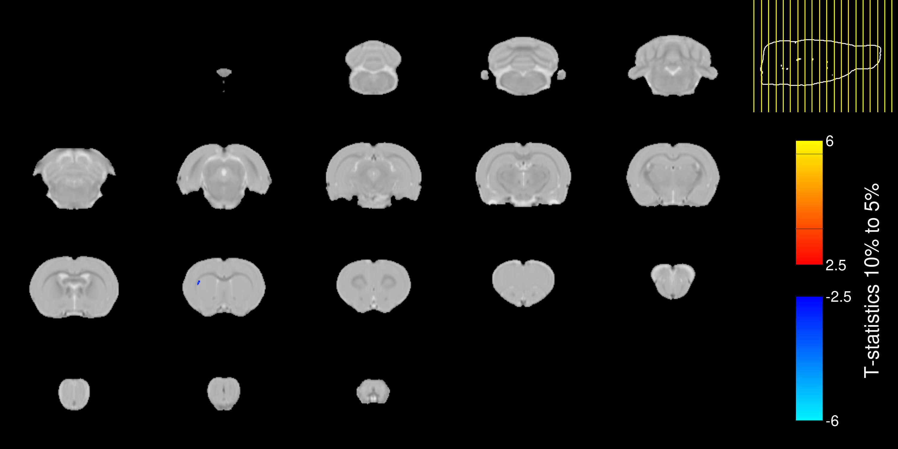
```
<p style="font-size:12pt" align="left"> Figura 2. Deformación volumétrica local en contraste de Alc+Str > Str Mapas de valores-t. El aumento de los volúmenes locales se representa con colores cálidos, mientras que la disminución de los volúmenes locales se representa con colores fríos. </span> </p>

]
]
---

## Ingesta por clasificación

.panelset[
.panel[.panel-name[Ingesta]

```{r fig.height=6, fig.width=11.8, message=FALSE, warning=FALSE, cache=FALSE, include=FALSE, paged.print=FALSE, results='asis',dpi=200}
pacman::p_load(lme4, performance, lcmm)

setwd("~/Documents/Psilantro/meh2/Semestre_4/")

dataAlc <- read_csv("datasetAlc_all.csv") %>% filter(Batch %in% c(4,5)) %>% 
  filter( Phase == "Ethanol Exposure" ) %>% 
  select(RID,Weight_kg, main_intake,Age,Group, Session, Batch) %>% 
  mutate(main_intake = case_when(main_intake <=10 ~ main_intake))


dataAlcStr <- read_csv("datasetAlcTSr_all.csv") %>% 
  filter( Phase == "Ethanol Exposure" ) %>% 
  select(RID,Weight_kg, main_intake,Age,Group, Session, Batch) %>% 
  mutate(main_intake = case_when(main_intake <=10 ~ main_intake))

dataAS <- rbind(dataAlc,dataAlcStr)

set.seed(42)
lcmm_model <-lcmm(main_intake ~ I(Age-45),
                  random = ~Batch, 
                  subject='RID', 
                  ng=1,
                  link = "linear",
                  data= dataAS)

lcmm_alcohol_2c <- gridsearch(rep = 30, maxiter = 100, minit = lcmm_model,
                              lcmm(main_intake ~ I(Age-45),  
                                   random = ~Batch, 
                                   mixture = ~I(Age-45), 
                                   subject="RID", data=dataAS, 
                                   maxiter=200, 
                                   link = "linear",
                                   ng=2)) 

classd <- as.data.frame(lcmm_alcohol_2c$pprob[,1:2])

datad <- full_join(dataAS, classd, by ="RID")

datad$class <- as.factor(datad$class)

## Visu
cuca <- datad %>% filter(Batch %in% c(4,5))

cuco <- cuca %>% mutate(clases = case_when(class == 1 & Group == "Alc" ~ 1,
                                   class == 2 & Group == "Alc" ~ 2,
                                   class == 1 & Group == "Alc+Str" ~ 3,
                                   class == 2 & Group == "Alc+Str" ~ 4))
cuco$clases <- factor(cuco$clases)

```

```{r echo=FALSE, fig.height=6, fig.width=11.8, message=FALSE, warning=FALSE, cache=FALSE, paged.print=FALSE, results='asis',dpi=200}

plot_lc <- ggplot(cuco, aes(Session, main_intake, group=Session, colour=clases)) +
  geom_smooth(aes(group=clases),method = NULL,  size=2, se=F) +
  scale_colour_manual(values = c("#008B8B","#CD3333","#4c8b00","#cd9333"), 
                      labels = c("Alc bajo (4)","Alc alto (4)","Alc+Str bajo (1)", "Alc+Str alto (6)")) +
  theme_bw(base_size = 16) + 
  labs(x="Sesiones",y="Consumo EtOH (g/Kg 24 hrs)",colour="Clases latentes") +
  annotate("rect", xmin = 0, xmax = 6, ymin = 0, ymax = 5,alpha = .2)
plot_lc

```

<p style="font-size:12pt" align="left"> Figura 3. Modelo de clasificación entre alta y baja ingesta de etanol (n de cada grupo). Área sombreada indica la fase aguda de la intervención. </span> </p>

]
]

---
## Perspectivas

- Completar la n (12 ratas por grupo).
- Realizar los análisis tomando en cuenta la clasificación por patrón de ingesta.
- Análisis Multimodal MRI.
- Extracción de EtOH en sangre y diferentes puntos de corticosterona.

---
class: inverse, middle, center
background-size: contain

## Gracias
