```{r xaringanExtra, echo=FALSE}
xaringanExtra::use_xaringan_extra(c("tile_view", "animate_css", "tachyons"))
```

```{r xaringan-panelset, echo=FALSE}
xaringanExtra::use_panelset()
```

```{r xaringan-scribble, echo=FALSE}
xaringanExtra::use_scribble()
```

```{r progress, echo = FALSE}
xaringanExtra::use_progress_bar(color = "#0051BA", location = "bottom", height = "4px")
```

```{r xaringan-logo, echo = FALSE}
xaringan_logo <- file.path(
"https://raw.githubusercontent.com/rstudio/hex-stickers/master",
"images/pdcb.png"
)
xaringanExtra::use_logo(xaringan_logo)
```


## ¿Cómo influye el estrés en el consumo de alcohol y cómo esto afecta el cerebro?
----

```{r echo=FALSE, fig.align='center', out.width='100%',dpi=200}
knitr::include_graphics('images/objetivo.png')
```

---

## Panorama en México
----

- El alcoholismo es el padecimiento adictivo de mayor prevalencia.

```{r echo=FALSE, fig.align='center',out.width='100%',dpi=300}
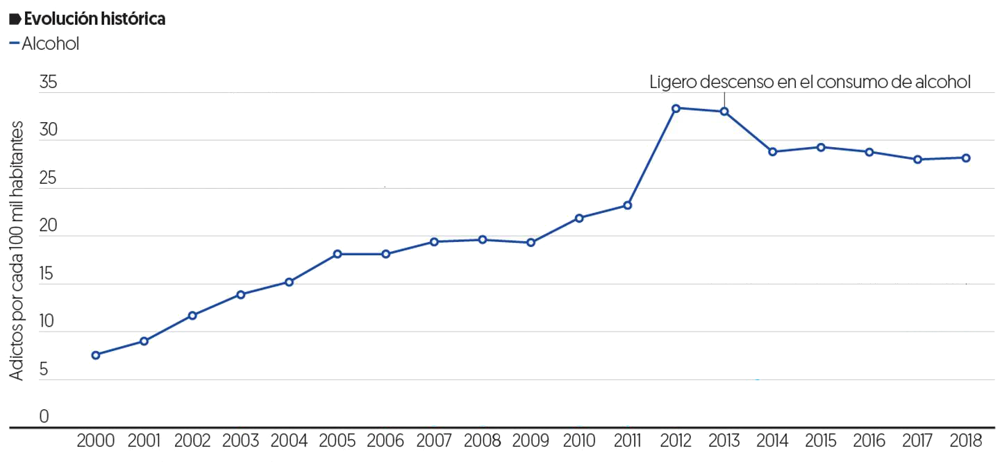
```
<p style="font-size:14pt" align="center"> Prevalencia en México de población adicta al consumo de alcohol </span> </p>

.footnote[----
Fuente: CIJ, INEGI y GLAC consulting]

---

## Trastorno por uso de alcohol
----

Patrón desadaptativo de consumo que conlleva un deterioro o malestar clínicamente significativo (DSM-V).

```{r echo=FALSE, fig.align='center', out.width='42%',dpi=200}
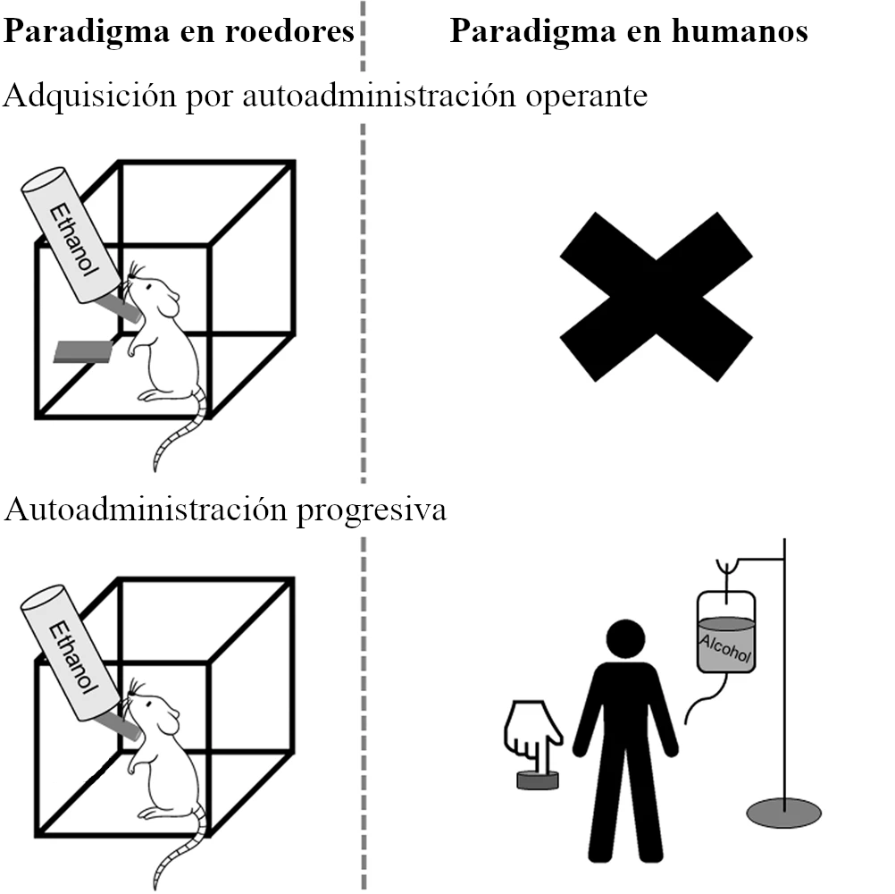
```
<p style="font-size:14pt" align="center"> Paradigmas en roedores y humanos para el estudio del trastorno por uso de alcohol (Modificado de <span style="color:Blue">Nieto et al., 2021</span>) </p>

.footnote[----
American Psychiatric Association. (2013). Diagnostic and statistical manual of mental disorders (5th ed.)   

Nieto, S.J., Grodin, E.N., Aguirre, C.G. et al. (2021). Translational opportunities in animal and human models to study alcohol use disorder. Transl Psychiatry.]

---

## Vías implicadas en el consumo
----

</br>
</br>

```{r echo=FALSE, fig.align='center', out.width='80%',dpi=200}
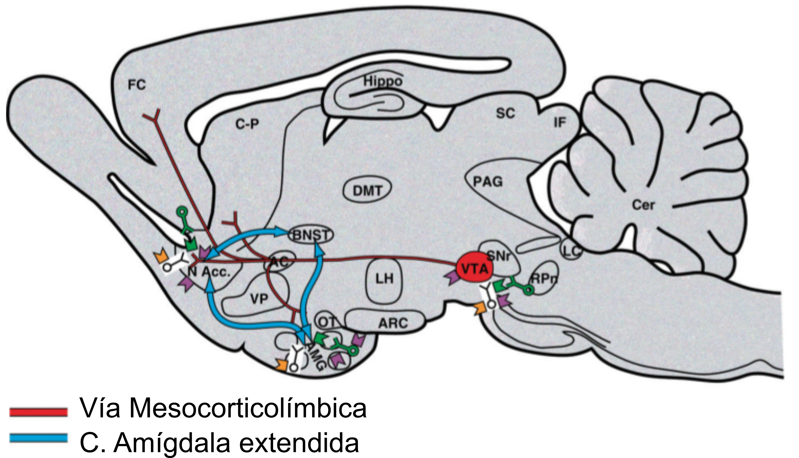
```
<p style="font-size:14pt" align="center"> Esquema de las vías implicadas en el consumo de alcohol (Modificado de <span style="color:Blue">Koob & Volkow, 2010</span>) </p>

.footnote[----
Koob, G. F., & Volkow, N. D. (2010). Neurocircuitry of addiction. Neuropsychopharmacology.]

---

## Factores implicados en el alcoholismo
----

</br>

```{r echo=FALSE, fig.align='center', out.width='40%',dpi=200}
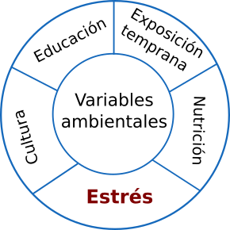
```
<p style="font-size:14pt" align="center"> Factores asociados al consumo adictivo de alcohol
 (Modificado de <span style="color:Blue">Kwako et al, 2017</span>) </p>
 
 .footnote[----
Kwako et al., (2017). Addictions Neuroclinical Assessment: A reverse translational approach. Neuropharmacology]

---

## Estrés
----
- Percepción de la demanda excesiva del ambiente sobre la capacidad de un organismo <span style="color:Blue"> (Ruisoto $\&$ Contador, 2019) </span> e implica varios cambios fisiológicos que incluyen la activación del eje HPA.

```{r echo=FALSE, fig.align='center', out.width='35%',dpi=200}
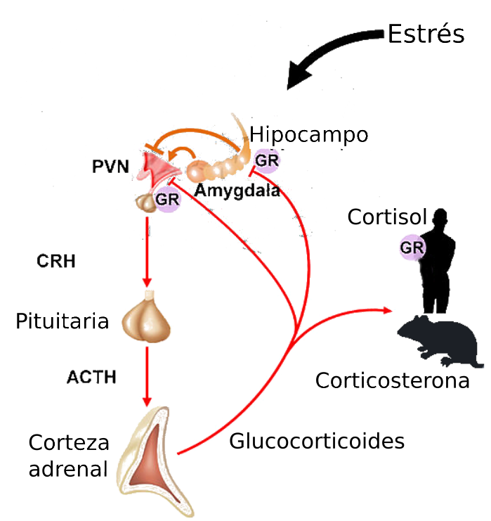
```
<p style="font-size:14pt" align="center"> Eje hipotálamo-pituitaria-adrenal (HPA) (Modificado de <span style="color:Blue">Joachim & Spangler, 2013</span>) </p>

.footnote[----
Ruisoto $\&$ Contador. (2019). The role of stress in drug addiction. An integrative review   
Joachim & Spengler. (2013). Epigenetic risk factors in PTSD and depression. Molecular Neuroendocrinology]

---

## Efectos por estrés crónico
----

- El estrés crónico genera efectos sobre la ganancia de peso y en regiones cerebrales.

.pull-left[
```{r echo=FALSE, fig.align='center', out.width='100%',dpi=200}
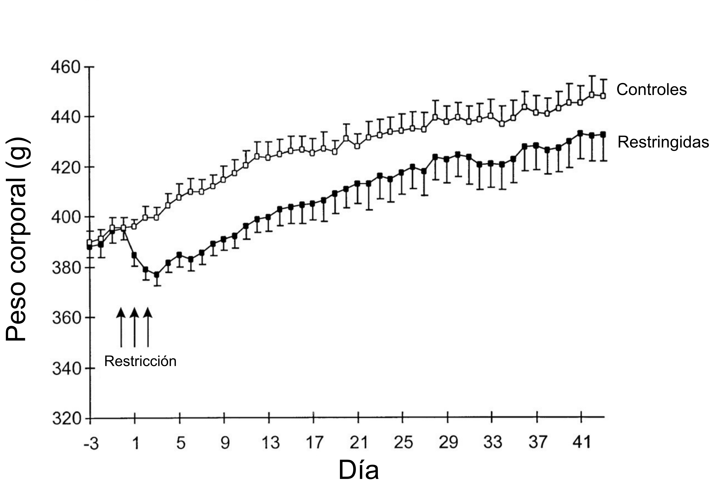
```
<p style="font-size:14pt" align="center"> Peso corporal diario (±SE) de ratas  restringidas durante 3 h/día (Modificado de <span style="color:Blue">Harris et al., 1998</span>) </p>
]

.pull-right[
```{r echo=FALSE, fig.align='center', out.width='100%',dpi=200}
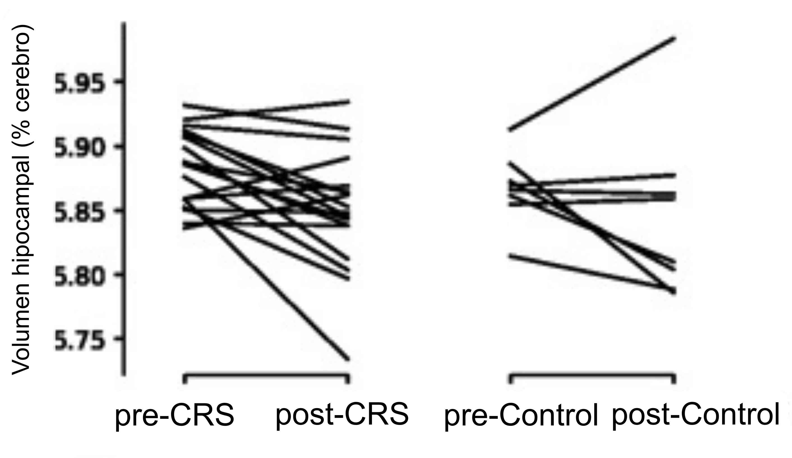
```
<p style="font-size:14pt" align="center"> Disminución del porcentaje de volumen del hipocampo tras 13 días de restricción (Modificado de <span style="color:Blue">Seewoo et al., 2020</span>) </p>
]

.footnote[----
Harris et al. (1998). Effect of repeated stress on body weight and body composition of rats fed low- and high-fat diets   
Seewoo et al. (2020). Validation of Chronic Restraint Stress Model in Young Adult Rats for the Study of Depression Using Longitudinal Multimodal MR Imaging. eNeuro.
]

---

### <span style="color:#0591d2">¿El estrés crónico afecta el consumo de alcohol?</span>
----

.pull-left[
```{r echo=FALSE, fig.align='center', out.width='85%',dpi=200}
knitr::include_graphics('images/sisali.png')
```
<p style="font-size:10pt" align="center"> Aumento de consumo (Modificado de <span style="color:Blue">Gomez et al., 2012</span>) </p>

```{r echo=FALSE, fig.align='center', out.width='81%',dpi=200}
knitr::include_graphics('images/no_consumo.png')
```
<p style="font-size:10pt" align="center"> Sin cambios en consumo (Modificado de <span style="color:Blue">Chester et al., 2004</span>) </p>

]

.pull-right[
```{r echo=FALSE, fig.align='center', out.width='81%',dpi=200}
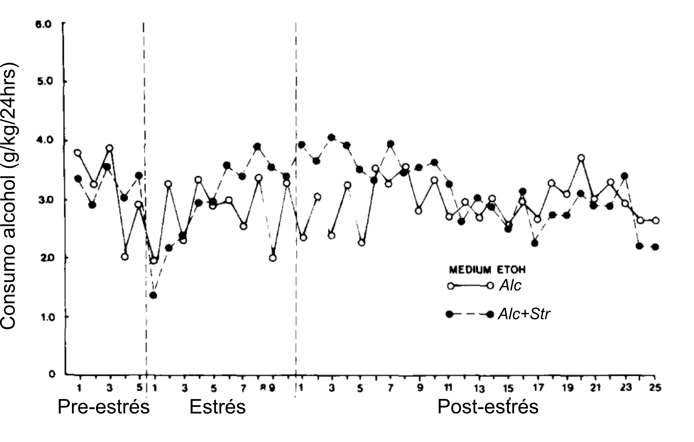
```
<p style="font-size:10pt" align="center"> Aumento de consumo (Modificado de <span style="color:Blue">Rockman et al., 1996</span>) </p>

```{r echo=FALSE, fig.align='center', out.width='81%',dpi=200}
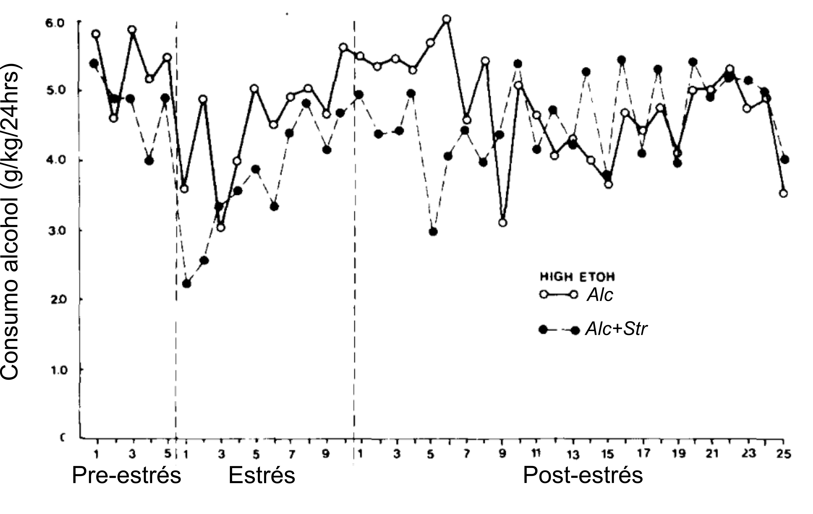
```
<p style="font-size:10pt" align="center"> Disminución de consumo (Modificado de <span style="color:Blue">Rockman et al., 1996</span>) </p>

]

.footnote[----
Gomez, et al. (2012). The interaction of chronic restraint stress and voluntary alcohol intake: effects on spatial memory in male rats   
Chester, et al. (2004). Effects of stress on alcohol consumption in rats selectively bred for high or low alcohol drinking
]

---

## Objetivo
----

.blockquote[
<span style="color:#000000"> Determinar los biomarcadores conductuales y cerebrales relacionados a la influencia del estrés sobre la consumo de alcohol. </span>
]

```{r echo=FALSE, fig.align='center', out.width='90%',dpi=200}
knitr::include_graphics('images/objetivo.png')
```

---

## Objetivos particulares
----
.blockquote[

- <span style="color:#000000"> Caracterizar los efectos del estrés crónico y del consumo de alcohol a nivel conductual </span>
- <span style="color:#000000"> Estudiar el efecto del estrés crónico sobre la conducta de consumo de alcohol y preferencia por la sustancia. </span>
- <span style="color:#000000"> Caracterizar la conducta de ansiedad producida por el estrés crónico y el consumo de alcohol </span>
- <span style="color:#000000"> Caracterizar los efectos del estrés y el consumo de alcohol sobre la memoria </span>
- <span style="color:#000000"> Determinar los cambios cerebrales estructurales macroscópicos producidos por el consumo crónico de alcohol en presencia o ausencia de estrés crónico. </span>
- <span style="color:#000000"> Determinar los cambios cerebrales funcionales macroscópicos producidos por el consumo crónico de alcohol en presencia o ausencia de estrés crónico. </span>
]

---

## Hipótesis
----

.blockquote[

- <span style="color:#000000"> El estrés crónico incrementará el nivel de consumo de alcohol en un modelo de AUD en ratas. </span>
- <span style="color:#000000"> El grupo de alcohol + estrés tendrá mayores déficits cognitivos y en comportamiento reflejado por las pruebas de laberinto elevado y reconocimiento de objeto novedoso. </span>
- <span style="color:#000000"> Las ratas con fenotipo alcohólico tendrán alteraciones en volumen cerebral. En específico, se espera un aumento de volumen en corteza cingulada posterior, amígdala y corteza medial prefrontal, así como disminución en tálamo, caudado, putamen y giro dentado </span> 
- <span style="color:#000000"> El consumo crónico de alcohol más estrés crónico producirá un incremento en conectividad funcional entre la amígdala y la ínsula y/o estriado. </span>
- <span style="color:#000000"> El consumo crónico de alcohol más estrés crónico producirá incrementos en las alteraciones conductuales y en el déficit cognitivo en comparación con ratas con AUD sin estrés. </span>
]

---

## Diseño experimental
----

</br>

```{r echo=FALSE, fig.align='center', out.width='50%',dpi=200}
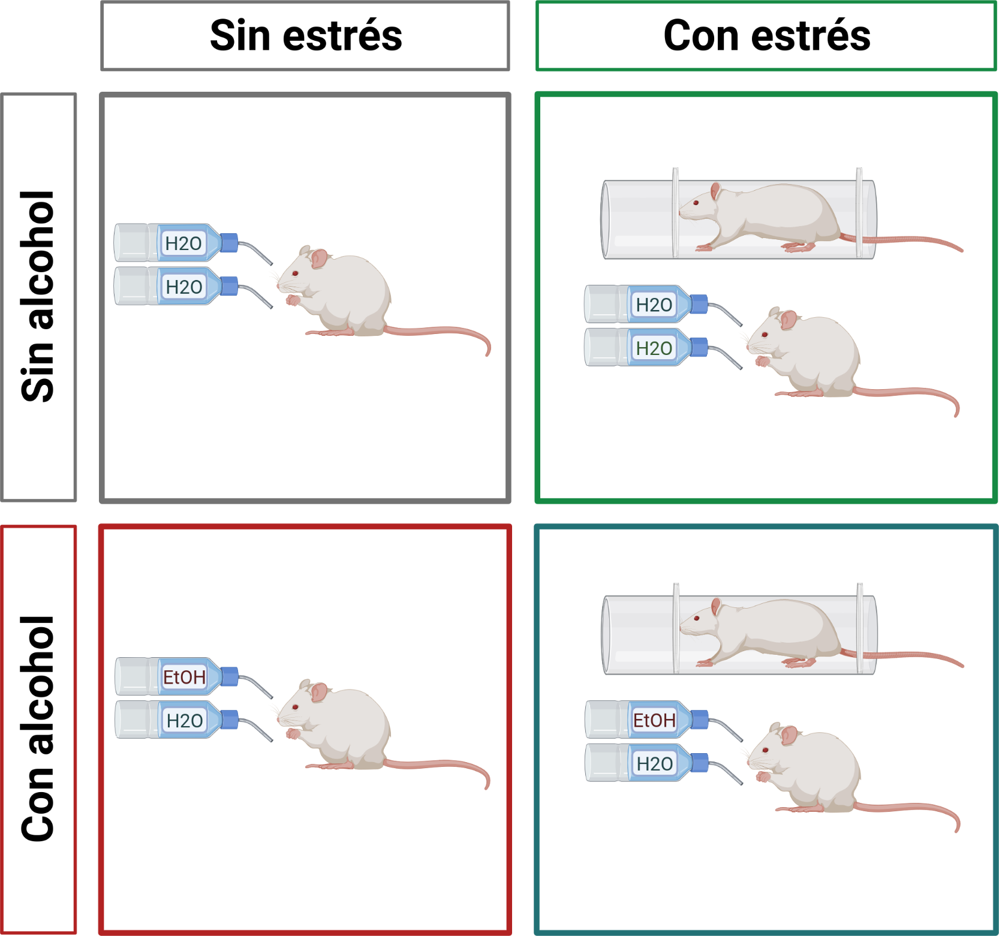
```
<p style="font-size:12pt" align="center"> Figura 1. Diseño experimental </span> </p>

---

## Estandarización

.panelset[
.panel[.panel-name[Modelos]

A | Modelo de acceso intermitente a dos botellas (IA2BC)   
B | Modelo de estrés crónico por restricción de movimiento (CRS)

</br>

```{r echo=FALSE, fig.align='center', out.width='80%',dpi=200}
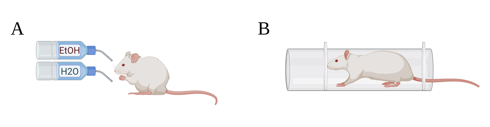
```

]
.panel[.panel-name[IA2BC]
```{r echo=FALSE, fig.align='center', out.width='55%',dpi=200}
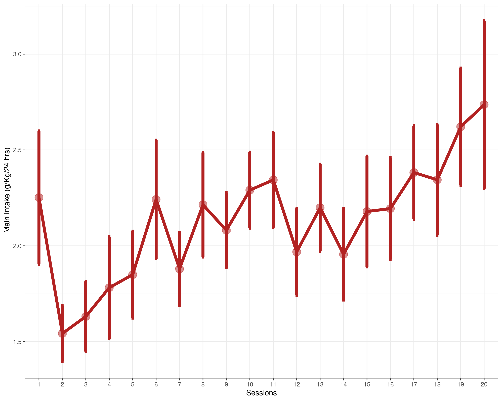
```
<p style="font-size:12pt" align="center"> Figura 2. consumo de etanol en ratas Wistar inducida por el modelo IA2BC durante la exposición al etanol </span> </p>

]
.panel[.panel-name[CRS]
```{r echo=FALSE, fig.height=5.5, fig.width=11.8, message=FALSE, warning=FALSE, cache=FALSE, paged.print=FALSE, results='asis',dpi=200}

setwd("/home/jalil/Documents/Psilantro/meh2/Semestre_4/data/pilot/")
pacman::p_load(tidyverse,ggthemes,cowplot,ggstatsplot,ggpubr, plotly)
stress_batch1_read<-read_csv("Stress_pilot.csv")
std <- function(x) sd(x)/sqrt(length(x))
stress_batch1 <- stress_batch1_read %>% group_by(Group,Age) %>% 
  summarise(Weigthstd=std(Weight_base),Weight=mean(Weight_base))

stress_batch1_Weight <- ggline(stress_batch1, 
                          x = "Age", xlab = "Edad",
                          y =  "Weight", group = "Grupo",
                          add = c("mean_se"), size=2,color = "Group", 
                          ylab = "Peso (kg)") +
                        scale_color_excel_new() + 
                        theme(text = element_text(size=20),
                              axis.text.x = element_text(size=15)) +
  scale_x_discrete(breaks = c("P47", "P52", "P57", "P62", "P67", "P72", "P77"))
  
stress_batch1_Weight
```
<p style="font-size:12pt" align="center"> Figura 3. Crecimiento longitudinal en peso de cada grupo. Se muestra el cambio de peso desde el inicio del protocolo de estrés crónico. </span> </p>
]
]

---

## Protocolo

</br>
</br>
</br>

```{r echo=FALSE, fig.align='center', out.width='90%',dpi=200}
knitr::include_graphics('images/secuencia2_1.png')
```
<p style="font-size:12pt" align="center"> Figura 4. Protocolo del modelo de acceso intermitente por 2 botellas (IA2BC) y de estrés crónico por restricción de movimiento (CRS). </span> </p>

---

## Protocolo

</br>
</br>
</br>

```{r echo=FALSE, fig.align='center', out.width='90%',dpi=200}
knitr::include_graphics('images/secuencia2_2.png')
```
<p style="font-size:12pt" align="center"> Figura 4. Protocolo del modelo de acceso intermitente por 2 botellas (IA2BC) y de estrés crónico por restricción de movimiento (CRS). </span> </p>

---

## Protocolo

</br>
</br>
</br>

```{r echo=FALSE, fig.align='center', out.width='90%',dpi=200}
knitr::include_graphics('images/secuencia2_3.png')
```
<p style="font-size:12pt" align="center"> Figura 4. Protocolo del modelo de acceso intermitente por 2 botellas (IA2BC) y de estrés crónico por restricción de movimiento (CRS). </span> </p>

---

## Protocolo

</br>
</br>
</br>

```{r echo=FALSE, fig.align='center', out.width='90%',dpi=200}
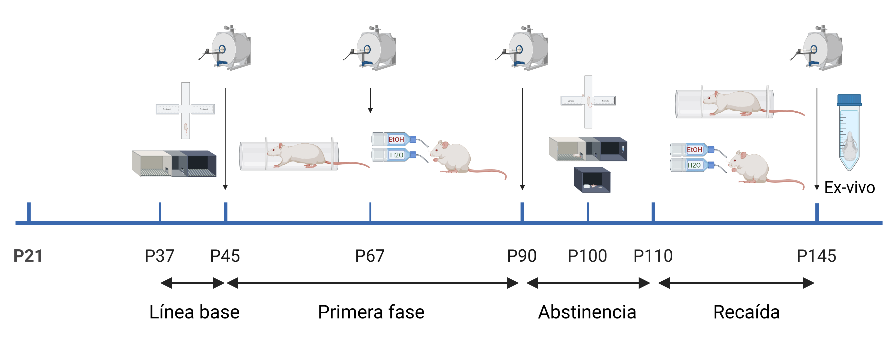
```
<p style="font-size:12pt" align="center"> Figura 4. Protocolo del modelo de acceso intermitente por 2 botellas (IA2BC) y de estrés crónico por restricción de movimiento (CRS). </span> </p>

---

## Método
----

#### Materiales

- A | Dos botellas, una con agua y otra con Etanol al 20% 
- B | Restrictor de movimiento construido en acrílico con ajuste para el tamaño de la rata

```{r echo=FALSE, fig.align='center', out.width='50%',dpi=200}

```
#### Animales: 
<p style="font-size:12pt">
- 30 ratas Wistar (16 hembras): (Alc = 8, Ctrl = 8, Str = 7, Alc+Str = 7) </br>
- Ciclo invertido 12h (oscuridad/luz): encendido 7 am </br>
- Restricción: lapso 11:00-14:00 </br>
- El peso corporal y el alimento fueron medidos diariamente como medidores de respuesta a estrés </br>
- Extracción de sangre para prueba de corticosterona (~12:00 pm), posterior a 1 hr de restricción.
</p>

---
background-image: url("assets/DLC.png")
background-size: 90px
background-position: 95% 2%

## Pruebas conductuales
----

</br>
</br>

```{r echo=FALSE, fig.align='center', out.width='90%',dpi=200}
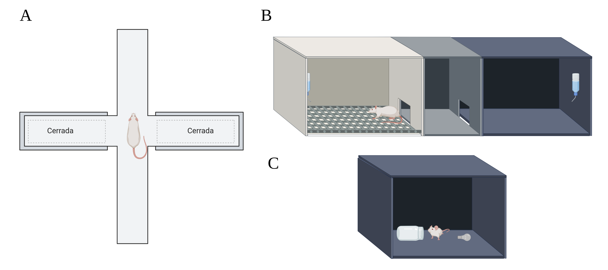
```

<p style="font-size:12pt">
- A | LEC: 5 minutos <span style="color:Blue">(Walf and Frye, 2007)</span> </br>
- B | CPL: 10 y 30 minutos <span style="color:Blue">(Lucke-Wold, 2011)</span> </br>
- C | NOR: 3 minutos
</p>

.footnote[----
Walf, A. A., & Frye, C. A. (2007). The use of the elevated plus maze as an assay of anxiety-related behavior in rodents. Nature protocols </br>
Lucke-Wold, Brandon. (2011). The Varied Uses of Conditioned Place Preference in Behavioral Neuroscience Research: An Investigation of Alcohol Administration in Model Organisms.]

---

## Efectos por estrés

.panelset[
.panel[.panel-name[Peso]

```{r echo=FALSE, fig.height=5.1, fig.width=11.8, message=FALSE, warning=FALSE, cache=FALSE, paged.print=FALSE, results='asis',dpi=200}
setwd("/home/jalil/Documents/Psilantro/meh2/")

pacman::p_load(tidyverse,data.table,ggpubr,plyr,hablar,ggstatsplot,
               ggthemes,rstatix,lme4,ggdist,distributional,
               emmeans,sjstats,easystats)

setwd("~/Documents/Psilantro/meh2/Semestre_3/Tutoral3/Datasets/")
files <- list.files(pattern = "*.csv")
data <- rbind.fill(lapply(files, fread, header=TRUE))
data_j <- data %>%  convert(chr(Sex,RID,Session,Phase),
                            num(Age,Weight_kg,EtOH,H2O,Weight_kg_base)) 

data3_all <- data_j %>%
  filter(Condition_day == "EtOH") %>% 
  select(RID,Sex,Session,Weight_kg,Weight_kg_base,Group,Condition, EtOH,H2O, Phase) %>%
  gather(EtOH, H2O, value = "value", key = "Bottle") %>%
  spread(Condition,value) %>% 
  group_by(Bottle) 

data3_all <- data3_all %>% mutate(`24_hrs` = case_when(`24_hrs` >=40 ~ `24_hrs`))

Data <- data3_all %>% 
  mutate(start_30mins = start - `30_mins`, 
         start_24_hrs = start - `24_hrs`,
         main_intake = (start_24_hrs * Weight_kg),
         basal_start = start - 27, 
         basal_30min = `30_mins` - 27,
         Basal_24hrs = `24_hrs` - 27,
         T_30min = basal_start - basal_30min,
         T_24hrs = basal_start - Basal_24hrs,
         Total_fluid_intake_24_ml = (T_24hrs * 100)/98.0608,
         Total_fluid_intake_30_ml = (T_30min * 100)/98.0608,
         Binge = (start_30mins* Weight_kg)) 

Data <-  Data %>% 
  filter(Bottle == "EtOH") 
Data$Session <- as.numeric(Data$Session)

Data <- Data %>% rename(replace = c("Group"="Grupo"))
Data <- Data %>% mutate(Phase = case_when(Phase == "Model" ~ "Autoadministración crónica",
                                  Phase == "Relapse" ~ "Recaída"))

Crecimiento.plt <- ggline(Data %>% filter(Phase=="Autoadministración crónica"), 
                          x = "Session", xlab = "Sesión",
                          y =  "Weight_kg_base", group = "Grupo",
                          add = c("mean_se"), size=2,color = "Grupo", 
                          facet.by = "Phase",ylab = "Peso (kg)",
                          palette = c("#B22222","#217175","#737373", "#168a44")) +
  annotate("rect", xmin = 1, xmax = 6, ymin = 0, ymax = 0.25,alpha = .2) +
  annotate(geom="text", x=11, y=0.24, label="*",
           color="black") +
  annotate(geom="text", x=12, y=0.24, label="*",
           color="black") +
  annotate(geom="text", x=13, y=0.24, label="*",
           color="black") +
  annotate(geom="text", x=15, y=0.24, label="*",
           color="black") +
  annotate(geom="text", x=16, y=0.24, label="*",
           color="black") +
  annotate(geom="text", x=17, y=0.24, label="*",
           color="black") +
  annotate(geom="text", x=18, y=0.24, label="*",
           color="black") +
  annotate(geom="text", x=19, y=0.24, label="*",
           color="black") + theme(text = element_text(size=20),
                                  axis.text.x = element_text(size=15))

Crecimiento.plt_abs <- ggline(Data %>% filter(Phase=="Recaída"), 
                          x = "Session", xlab = "Sesión",
                          y =  "Weight_kg_base", group = "Grupo",
                          add = c("mean_se"), size=2,color = "Grupo", 
                          facet.by = "Phase",ylab = "Peso (kg)",
                          palette = c("#B22222","#217175","#737373", "#168a44")) +
  annotate("rect", xmin = 1, xmax = 5, ymin = 0, ymax = 0.25,alpha = .2) +
  annotate(geom="text", x=1, y=0.26, label="*",
           color="black") +
  annotate(geom="text", x=4, y=0.26, label="*",
           color="black") +
  annotate(geom="text", x=5, y=0.26, label="*",
           color="black") +
  annotate(geom="text", x=6, y=0.26, label="*",
           color="black") +
  annotate(geom="text", x=7, y=0.26, label="*",
           color="black") +
  annotate(geom="text", x=11, y=0.26, label="*",
           color="black") +
  annotate(geom="text", x=13, y=0.26, label="*",
           color="black") +
  annotate(geom="text", x=14, y=0.26, label="*",
           color="black") + theme(text = element_text(size=20),
                                  axis.text.x = element_text(size=15))

Crecimiento_both <- ggarrange(Crecimiento.plt,Crecimiento.plt_abs +
            theme(axis.title.y = element_blank(),
                  axis.text.y = element_blank()),
          common.legend = T)

Crecimiento_both

```
<p style="font-size:12pt" align="center"> Figura 5. Ganancia de peso de cada grupo  lo largo del protocolo. Se muestra el cambio de peso desde el inicio del protocolo de estrés y IA2BC. Área sombreada indica la fase aguda de la intervención. </span> </p>

]
.panel[.panel-name[Corticosterona]
```{r echo=FALSE, fig.height=5.5, fig.width=11.8, message=FALSE, warning=FALSE, cache=FALSE, paged.print=FALSE, results='asis',dpi=200}
setwd("~/Documents/Alc_model/")

Cort_lev <- readxl::read_excel("Cort_levels.xlsx")
Cort_lev_std <- Cort_lev %>% slice(1:6)
Strss <- Cort_lev %>% slice(7:42) %>% select(1:3)
cuca <- lm(formula = Y~log(Absorbance),data = Cort_lev_std)

Strss$Y <- predict(cuca,Strss)
both <- rbind(Cort_lev_std,Strss) %>% 
  mutate(Y = case_when(Y = Y >= 0 ~ Y,
                       Y = Y <= 0 ~ 0.01)) %>% 
  mutate(Y = Y*2.886)

cortico <- both %>% slice(7:42) %>% 
  ggbetweenstats(x=Group,y=Y, type = "np", p.adjust.method = "fdr",
                 plot.type = "violin",ylab = "Corticosterona (nmol/L)",
                 xlab = "Grupo",
                 centrality.point.args = list(size = 3, color = "darkred")) +
  theme(text = element_text(size = 14),
        axis.text = element_text(size = 16), 
        axis.title = element_text(size=18)) +
  scale_color_manual(values = c("#B22222","#217175","#737373", "#168a44"))
cortico

```
<p style="font-size:12pt" align="center"> Figura 6. Medición de corticosterona en el P142 en una submuestra. </span> </p>

]
.panel[.panel-name[EPM]

```{r echo=FALSE, fig.height=5.5, fig.width=11.8, message=FALSE, warning=FALSE, cache=FALSE, paged.print=FALSE, results='asis',dpi=200}
setwd("/home/jalil/Documents/Psilantro/meh2/Semestre_4/Analisis/Conducta/")
EPM <- read_csv("EPM_average.csv")

EPM <- EPM %>% rename(replace = c("Group"="Grupo"))
EPM <- EPM %>% mutate(Arm = case_when(Arm == "Closed" ~ "Cerrado",
                                      Arm == "Open" ~ "Abierto"),
                      Grupo=factor(Grupo),
                      RID=factor(RID),
                      Stage=factor(Stage),
                      Arm=factor(Arm),
                      Age=factor(Age),
                      Sex=factor(Sex)) 

EPM_closed <- EPM %>% filter(Arm=="Cerrado")

EPM_closed.aov <- anova_test(data = EPM_closed, dv = Time, wid = RID,
                             between = Grupo, within = Stage)

# Pairwise comparisons between time points at each group levels
# Paired t-test is used because we have repeated measures by time
EPM_closed.pwc2 <- EPM_closed %>%
  group_by(Grupo) %>%
  pairwise_t_test(
    Time ~ Stage, paired = TRUE, 
    p.adjust.method = "fdr")

## Visualization
EPM_closed.pwcC <- EPM_closed.pwc2 %>% 
  add_xy_position(x = "Stage",group = "Grupo",
                  step.increase = 1,fun = "mean_se")

my_pal <- c("#B22222","#217175","#737373", "#168a44")

plot_EPM.closed <- EPM_closed %>%
  ggplot(aes(x = Stage,y = Time, 
             fill = Grupo)) +
  stat_halfeye(position = "dodge",
               adjust = .9, width = .7) +
  gghalves::geom_half_point(aes(color = Grupo),
                            side = "l", 
                            range_scale = .3, 
                            alpha = .4, size = 2) + 
  stat_pvalue_manual(EPM_closed.pwcC,
                     tip.length = 0.03, hide.ns = TRUE) +
  labs(subtitle = get_test_label(EPM_closed.aov, 
                                 detailed = FALSE),
       caption = get_pwc_label(EPM_closed.pwcC)) +
  xlab("Punto de tiempo") + ylab("Tiempo (s)") +
  scale_color_manual(values = my_pal) +
  scale_fill_manual(values = my_pal) + 
  theme_ggdist() +
  theme(text = element_text(size = 18),
        plot.subtitle = element_text(hjust = 1)) 

EPM_open <- EPM %>% filter(Arm=="Abierto")

EPM_open.aov <- anova_test(data = EPM_open, dv = Time, wid = RID,
                             between = Grupo, within = Stage)

EPM_open.pwc2 <- EPM_open %>%
  group_by(Grupo) %>%
  pairwise_t_test(
    Time ~ Stage, paired = TRUE, 
    p.adjust.method = "fdr")

## Visualization
EPM_open.pwcC <- EPM_open.pwc2 %>% 
  add_xy_position(x = "Stage",group = "Grupo",
                  step.increase = 1,fun = "mean_se")

my_pal <- c("#B22222","#217175","#737373", "#168a44")

plot_EPM.open <- EPM_open %>%
  ggplot(aes(x = Stage,y = Time, 
             fill = Grupo)) +
  stat_halfeye(position = "dodge",
               adjust = .9, width = .7) +
  gghalves::geom_half_point(aes(color = Grupo),
                            side = "l", 
                            range_scale = .3, 
                            alpha = .4, size = 2) + 
  stat_pvalue_manual(EPM_open.pwcC,
                     tip.length = 0.03, hide.ns = TRUE) +
  labs(subtitle = get_test_label(EPM_open.aov, 
                                 detailed = FALSE),
       caption = get_pwc_label(EPM_open.pwcC)) +
  xlab("Punto de tiempo") + ylab("Tiempo (s)") +
  scale_color_manual(values = my_pal) +
  scale_fill_manual(values = my_pal) + 
  theme_ggdist() +
  theme(text = element_text(size = 18),
        plot.subtitle = element_text(hjust = 1))

#plot_EPM.open
ggarrange(plot_EPM.closed,plot_EPM.open+theme(axis.title.y = element_blank()),
          ncol = 2,common.legend = T, labels = "AUTO")
```
<p style="font-size:12pt" align="center"> Figura 7. Tiempo de exploración en brazos abiertos por punto de tiempo. A) Brazos cerrados, B) Brazos abiertos. </span> </p>

]
]

---

## Consumo de alcohol

.panelset[
.panel[.panel-name[consumo principal]

```{r echo=FALSE, fig.height=5.5, fig.width=11.8, message=FALSE, warning=FALSE, cache=FALSE, paged.print=FALSE, results='asis',dpi=200}
Data_al <-  Data %>% 
  filter(Bottle == "EtOH", Grupo == "Alc" | Grupo == "Alc+Str")
Data_al$Session <- as.numeric(Data_al$Session)

Intake_plot <- ggline(Data_al, x = "Session", y =  "main_intake", 
       group = "Grupo",add = c("mean_se"), size=1,color = "Grupo", 
       facet.by = "Phase",ylab = "Consumo EtOH (g/kg/24 hrs)",xlab = "Sesión",
       palette = c("#B22222","#217175","#737373", "#168a44")) +
  annotate("rect", xmin = 1, xmax = 5, ymin = 0, ymax = 7,alpha = .2) + 
  theme(text = element_text(size=20),
        axis.text.x = element_text(size=15))# + geom_smooth(aes(group=Grupo,color = Grupo),method = "glm",  size=1, se=F)

Intake_plot
```
<p style="font-size:12pt" align="center"> Figura 9. Consumo de etanol inducida por el modelo IA2BC durante cada fase. Área sombreada indica la fase aguda de la intervención. </span> </p>

]
.panel[.panel-name[Preferencia (CPP)]

```{r echo=FALSE, fig.height=5.1, fig.width=11.8, message=FALSE, warning=FALSE, cache=FALSE, paged.print=FALSE, results='asis',dpi=200}
setwd("/home/jalil/Documents/Psilantro/meh2/Semestre_3/Tutoral3/Bev/")
CPP <- read_csv("CPP.csv") %>% 
  mutate(Place = case_when(Place == "Dark" ~ "Water",
                           Place == "White" ~ "EtOH"),
         Batch = case_when(Batch == "4" ~ "Batch 4",
                           Batch == "5" ~ "Batch 5"))

B4cpp <- CPP %>% filter(Batch=="Batch 4") %>% 
  pivot_wider(names_from = Place,values_from = Time_seg) %>% 
  mutate(#Water = (Water*100)/600,
         #EtOH = (EtOH*100/600),
         Preferencia = EtOH/(EtOH+Water))

B5cpp <- CPP %>% filter(Batch=="Batch 5") %>% 
  pivot_wider(names_from = Place,values_from = Time_seg) %>% 
  mutate(#Water = (Water*100)/1800,
         #EtOH = (EtOH*100/1800),
         Preferencia = EtOH/(EtOH+Water))

Bcpp <- rbind(B4cpp,B5cpp)

Bcpp.aov <- anova_test(data = Bcpp, dv = Preferencia, wid = RID,
                             between = Group, within = Stage)

Bcpp.pwc2 <- Bcpp %>%
  group_by(Group) %>%
  pairwise_t_test(
    Preferencia ~ Stage, paired = TRUE, 
    p.adjust.method = "fdr")

Bcpp.pwcC <- Bcpp.pwc2 %>% 
  add_xy_position(x = "Time",group = "Group",
                  step.increase = 1,fun = "mean_se")

my_pal <- c("#B22222","#217175","#737373", "#168a44")

plot_Bcpp <- Bcpp %>%
  ggplot(aes(x = Stage,y = Preferencia, 
             fill = Group)) +
  stat_halfeye(position = "dodge",
               adjust = .9, width = .7) +
  gghalves::geom_half_point(aes(color = Group),
                            side = "l", 
                            range_scale = .3, 
                            alpha = .4, size = 2) + 
  stat_pvalue_manual(Bcpp.pwcC,
                     tip.length = 0.03, hide.ns = FALSE) +
  labs(subtitle = get_test_label(Bcpp.aov, 
                                 detailed = TRUE),
       caption = get_pwc_label(Bcpp.pwcC)) +
  xlab("Punto de tiempo") + ylab("Preferencia caja EtOH") +
  scale_color_manual(values = my_pal) +
  scale_fill_manual(values = my_pal) + 
  geom_hline(yintercept=0.5, linetype="dashed", color = "red") +
  theme_ggdist() +
  theme(text = element_text(size = 18),
        plot.subtitle = element_text(hjust = 1)) 

plot_Bcpp

```
<p style="font-size:12pt" align="center"> Figura 10. Preferencia de pasar más tiempo en caja EtOH entre pretest vs test. Línea punteada marcada a 0.5. Preferencia > 0.5 representa mayor tiempo en caja blanca (alcohol), mientras que < 0.5 representa mayor tiempo en caja negra (agua). </span> </p>

]
]

---

## Cambios cerebrales estructurales

.panelset[
.panel[.panel-name[Alc+Str > Alc]

```{r echo=FALSE, fig.align='center', out.width='85%',dpi=200}
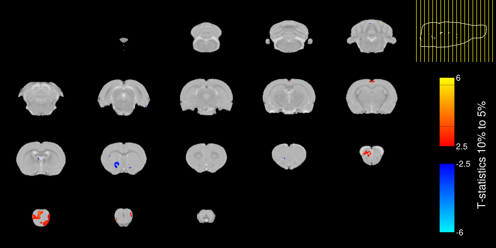
```
<p style="font-size:12pt" align="left"> Figura 11. Deformación volumétrica local en contraste de Alc+Str > Alc Mapas de valores-t. El aumento de los volúmenes locales se representa con colores cálidos, mientras que la disminución de los volúmenes locales se representa con colores fríos. </span> </p>

]
.panel[.panel-name[Alc+Str > Str]

```{r echo=FALSE, fig.align='center', out.width='85%',dpi=200}
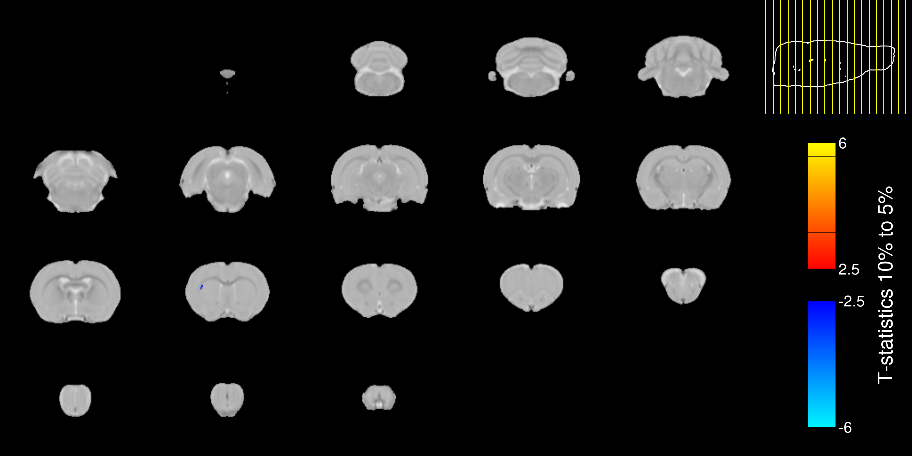
```
<p style="font-size:12pt" align="left"> Figura 12. Deformación volumétrica local en contraste de Alc+Str > Str Mapas de valores-t. El aumento de los volúmenes locales se representa con colores cálidos, mientras que la disminución de los volúmenes locales se representa con colores fríos. </span> </p>

]
]
---

## Variabilidad individual

.panelset[
.panel[.panel-name[consumo]

```{r fig.height=6, fig.width=11.8, message=FALSE, warning=FALSE, cache=FALSE, include=FALSE, paged.print=FALSE, results='asis',dpi=200}
pacman::p_load(lme4, performance, lcmm)

setwd("~/Documents/Psilantro/meh2/Semestre_4/")

dataAlc <- read_csv("datasetAlc_all.csv") %>% filter(Batch %in% c(4,5)) %>% 
  filter( Phase == "Ethanol Exposure" ) %>% 
  select(RID,Weight_kg, main_intake,Age,Group, Session, Batch) %>% 
  mutate(main_intake = case_when(main_intake <=10 ~ main_intake))


dataAlcStr <- read_csv("datasetAlcTSr_all.csv") %>% 
  filter( Phase == "Ethanol Exposure" ) %>% 
  select(RID,Weight_kg, main_intake,Age,Group, Session, Batch) %>% 
  mutate(main_intake = case_when(main_intake <=10 ~ main_intake))

dataAS <- rbind(dataAlc,dataAlcStr)

set.seed(42)
lcmm_model <-lcmm(main_intake ~ I(Age-45),
                  random = ~Batch, 
                  subject='RID', 
                  ng=1,
                  link = "linear",
                  data= dataAS)

lcmm_alcohol_2c <- gridsearch(rep = 30, maxiter = 100, minit = lcmm_model,
                              lcmm(main_intake ~ I(Age-45),  
                                   random = ~Batch, 
                                   mixture = ~I(Age-45), 
                                   subject="RID", data=dataAS, 
                                   maxiter=200, 
                                   link = "linear",
                                   ng=2)) 

classd <- as.data.frame(lcmm_alcohol_2c$pprob[,1:2])

datad <- full_join(dataAS, classd, by ="RID")

datad$class <- as.factor(datad$class)

## Visu
cuca <- datad %>% filter(Batch %in% c(4,5))

cuco <- cuca %>% mutate(clases = case_when(class == 1 & Group == "Alc" ~ 1,
                                   class == 2 & Group == "Alc" ~ 2,
                                   class == 1 & Group == "Alc+Str" ~ 3,
                                   class == 2 & Group == "Alc+Str" ~ 4))
cuco$clases <- factor(cuco$clases)

```

```{r echo=FALSE, fig.height=6, fig.width=11.8, message=FALSE, warning=FALSE, cache=FALSE, paged.print=FALSE, results='asis',dpi=200}

plot_lc <- ggplot(cuco, aes(Session, main_intake, group=Session, colour=clases)) +
  geom_smooth(aes(group=clases),method = NULL,  size=2, se=F) +
  scale_colour_manual(values = c("#008B8B","#CD3333","#4c8b00","#cd9333"), 
                      labels = c("Alc bajo (n = 4)","Alc alto (n = 4)","Alc+Str bajo (n = 1)", "Alc+Str alto (n = 6)")) +
  theme_bw(base_size = 16) + 
  labs(x="Sesiones",y="Consumo EtOH (g/Kg 24 hrs)",colour="Clases latentes") +
  annotate("rect", xmin = 0, xmax = 5, ymin = 0, ymax = 5,alpha = .2)
plot_lc

```
<p style="font-size:12pt" align="left"> Figura 13. Consumo de etanol durante la primera fase de exposición a etanol. Subgrupos clasificados entre alta y baja consumo. Área sombreada indica la fase aguda de la intervención. </span> </p>

]
]

---
## Perspectivas

- Completar la n (12 ratas por grupo).
- Realizar los análisis tomando en cuenta la clasificación por patrón de consumo.
- Extracción de EtOH en sangre y diferentes puntos de corticosterona.

```{r echo=FALSE, fig.align='center', out.width='60%',dpi=200}
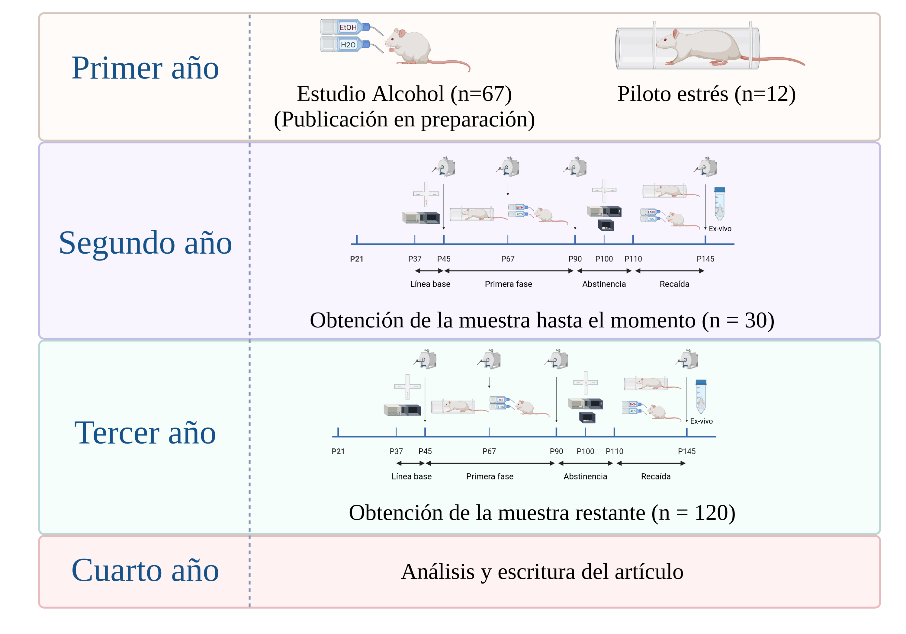
```

---
class: inverse, middle, center
background-size: contain

## <span style="color:#ffffff"> Gracias </span>
